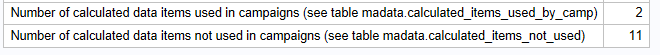

# CI Modernization Preparation Tool

The CI Modernization Preparation Tool is a customer-facing tool intended to support the modernization from CI 6.6 to SAS CI 360 by providing this information:
-	MA 6.6 campaign details and summary information
-	Data item in an Information Map with source and usage details
-	Data items used in campaigns and data items that are not used.
-	Calculated column expression and usage details
-	Usage of custom nodes and process nodes with stored processes and manual code
-	Campaigns migration order based on link nodes requiring linkable cells to pre-exist. 

Detailed tables are generated to support the clean-up of MA information maps and review of active campaigns before transitioning to 360 Direct. 

The tool also provides an overview of key metrics that are of interest for migrations. Where applicable, labels indicate where to find detailed data.

## Requirements

This tool requires a machine that
- can run SAS code 
- has a JAVA Runtime Environment
- has network access to the Metadata Server (default port 8651) and the SAS Webapp Server (default port 8080) of SAS Marketing Automation 6.6.

The SAS Marketing Automation Compute Server fits that prescription, but a workstation or laptop with a local SAS 9.4 would also works.

The 2_get_campign_data.sas script lauches the JAVA command. If your SAS Workspace Server has allowxcmd checked, you can run the code interactively in SAS Studio or in Enterprise Guide. if not, you can run it in batch or using the classic SAS Foundation Display Manager.

Usually only the PRODUCTION environment provides valuable output. It can be convenient to deploy the tool on a non-production server or workstation and configure it to connect to the production environment over the network.  

## Configuration

Perform these configuration steps on the machine where you deploy the tool:
1.	Download and unzip this tool to an appropriate utility location
e.g., *C:\sas\ci-modernization-preparation-tool*

2. Copy these CI client jar-files from your SAS (Mid-tier) Server to the mapo2xml/lib subfolder of the tool:
    - *.jar from : <SASConfig>\Lev1\Web\WebAppServer\SASServer6_1\sas_webapps\sas.customerintelligencestudio.war\WEB-INF\lib
    - log4j.jar from : <SASHome>\SASVersionedJarRepository\eclipse\plugins\Log4J_1.2.18.0_SAS_* (use the latest version)
    - sas.analytics.crm.ma.core.jar from : <SASHome>\SASVersionedJarRepository\eclipse\plugins\sas.analytics.crm.ma.core_* (use the latest version)
    - sas.analytics.crm.ma.persistence.jar from : <SASHome>\SASVersionedJarRepository\eclipse\plugins\sas.analytics.crm.ma.persistence_* (use the latest version)

3. If based on the requirements you decided to run the scrips in batch, adapt the **tool path** and the **location of the SAS executable** in *scripts/run_0_main.sh* for a Linux server or *scripts/run_0_main.cmd* for Windows.

4. Adapt the macro variables in *scripts/0_main.sas* to reflect your environments. 

    > **Note :** Configuration details and examples are available in the comment lines of the scripts.

5.	This tool has the JAVA command configured for a Windows environment. To deploy on Linux, change this statement in *scripts\2_get_campign_data.sas* : 

        filename cmd pipe "&JAVACMD. -cp ""&classpath."" MAPO2Xml &uid. &pass. ""&source."" ""&xml_file.""";

    to 

        filename cmd pipe %tslit(java -cp "&classpath.*" MAPO2Xml "&uid." "&pass." "&source." "&xml_file.");

## Usage

After performing the configuration steps, follow the guidance below to run these scripts sequentially.  
-	0_main.sas
-	1_get_metadata_campaigns.sas
-	2_get_campign_data.sas
-	3_get_imap_dataitems.sas
-	4_campaign_analysis.sas
-	5_calculated_items_analysis.sas
-	6_link_node_analysis.sas
You can find them in the /scripts folder. There is also an example batch script that you can use to run them in batch.

###	0_main.sas

-   Make sure the changes you made in the configuraton section are saved.
-   To run in batch:
    -   Uncomment *include* statements at the end of the 0_main.sas **one by one** to call the other scripts. 
    -   Run this main script via run_0_main.sh on linux or run_0_main.cmd on windows.
-   To run interactively: 
    -   Run each script sequentially.

> **Note :** Read the sections below as sometimes preparations or adaptations are needed.

> **Tip :** If you need to assess multiple business contexts, consider changing both the metadata_root_folder, that refers to the business context, and the dataFolder.  The meta_campaign table contains campaigns across all business contexts, so instead of rerunning 1_get_metadata_campaigns.sas, you can just copy over that table.

###	1_get_metadata_campaigns.sas

- 1_get_metadata_campaigns.sas extracts all *CI Selection* and *CI Decision* campaigns across all business contexts from the SAS Metadata Server and loads one row per campaign in meta_campaign table.

###	2_get_campign_data.sas

- 2_get_campaign_data is a longer running process that
    -   extracts the XML content per campaign, 
    -   parses the XML using the mapo.map XML map and 
    -   loads detailed data per campaign and nodes 
- This is the most resource intensive step, 1000 campaigns may take an hour to process.
    - For large environments consider running this in batch mode instead of in Enterprise Guide.
    - The *campaignfilter* macro variable selects campaigns inside a specific Business Context root folder.
- You can refine this filter/where clause using on any column of the meta_campaign. 

>**Tip :** Test your setup by filtering on a specific campaign as per the example in the code.

- Data from a previous run gets deleted. Comment out the PROC DELETE section in this code if you don't want combine results from multiple runs.
- This script writes logs to the logs folder
- The extraction make use of the JAVA command. Check the last section for details and troubleshooting.
- These output tables are selected in the screenshot below. 

### 3_get_imap_dataitems.sas

- 3_get_imap_dataitems.sas extracts the information map metadata from the SAS Metadata Server and loads MADATA.IMAP_DATAITEM_DETAIL. 
- This output table is used in the next step to identify used and unused data items.

###	4_campaign_analysis.sas

- 4_campaign_analysis.sas calculates a set of metrics using the tables created in the previous steps. These metrics indicate attention points for the migration and migration effort. 
- The metrics are returned in HTML output and is the campaign_summary SAS dataset and CSV

###	5_calculated_items_analysis.sas

- 5_calculated_items_analysis.sas provides and overview of calculated data items. 
    - The output of the Calculated data items is not required for the downstream processes, so the execution of this step is optional. 
- Before running the script, you need to get the required JSON files 
    - Sign in to SASCIStudio 6.6
    - Navigate to the list of Calculated data items 
    - F12 to displays the Browser Dev Tools as shown in the screenshots below.
    - Navigate to the Network tab.
    - Refresh the list of Calculated Items 
    - The screenshot below is taken at this point.
    - Copy the Response JSON
    - Paste to a text file in the data folder and name that file CI66CalcCols.json, or the name you chose in 0_main.sas. 

The output table provides the formulas details and usage info for the calculated items.

The key metrics report lists the number items used an not used

### 6_link_node_analysis.sas

Campaigns referenced by links should be imported in CI360 before the campaigns with the link nodes referring to them. 6_link_node_analysis.sas groups the campaigns to help define the import order. 

The key metrics report lists the number of campaigns per table.

#	MAPO2Xml java component details

This section is provided to help understand and, if needed, troubleshoot the tool.

MAPO2Xml is a java program that extract the details of the diagram nodes of a campaign into an XML file.

SAS Marketing Automation stores the state of campaigns and diagrams as Java objects on the SAS content server. MAPO2Xml is a tool that creates structured data from SAS Marketing Automation Java objects. This information includes latest node counts, node relations, export definitions etc.

##	Java tool content
- lib\MAPO2Xml.jar	
    -   This is the tool
- Various jar & system files 	
    -   Required jar files from the MA midtier (taken from 6.6). 893 in total
- java source code
    source\MAPO2Xml.java
    source\DownloadFile.java
    source\log4j.properties	Java source code

## MAPO2XML Java command details
To create an XML file from an MA Java object that sits on the SAS content server:
`Java MAPO2Xml <user> <password> <url> <target XML file>`

Example:

`C:\sas\ci-modernization-preparation-tool\MAPO2Xml>java -cp "C:\sas\ci-modernization-preparation-tool\MAPO2Xml\lib\*" MAPO2Xml sasdemo Orion123 "http://sasbap:8080/SASContentServer/repository/default/sasdav/Customer%20Intelligence/AC/MJ/ACMJOEFEIXBIQAAA" "samples\ACMJOEFEIXBIQAAA.xml"
read http://sasbap:8080/SASContentServer/repository/default/sasdav/Customer%20Intelligence/AC/MJ/ACMJOEFEIXBIQAAA in 671 ms
converted to xml in 322 ms
wrote C:\sas\ci-modernization-preparation-tool\MAPO2Xml\ACMJOEFEIXBIQAAA.xml in 207 ms
total 1230 ms

C:\sas\ci-modernization-preparation-tool\MAPO2Xml> 
 `

1.	Open a browser and get url for CI Studio – eg: http://sas-aap.demo.sas.com/ and substitute for “sasbap” in the URL below
http://sasbap.demo.sas.com:8080/SASContentServer/repository/default/sasdav/Customer%20Intelligence
Sign-in with CI Studio user and password
2.	Use this to browse the content-server to find URL for the campaign Java object by right-clicking on any of the objects as per the example below and copy link address.

 
Example: URL for campaign Java object = http://sasbap.demo.sas.com:8080/SASContentServer/repository/default/sasdavstomer%20Intelligence/DC/FC/DCFC2ENVTVB4SXSS
