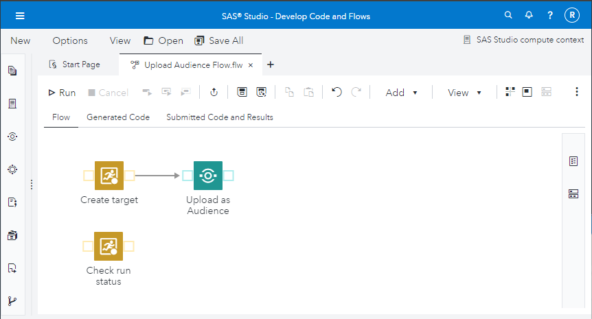
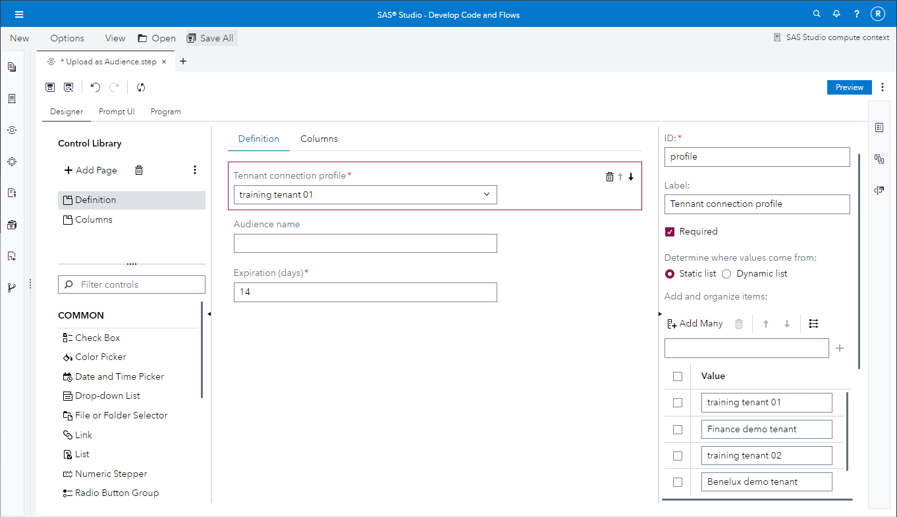
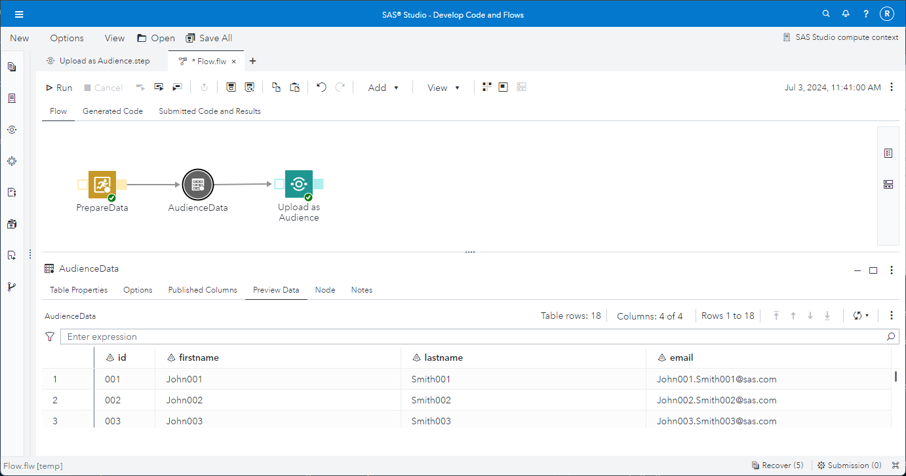
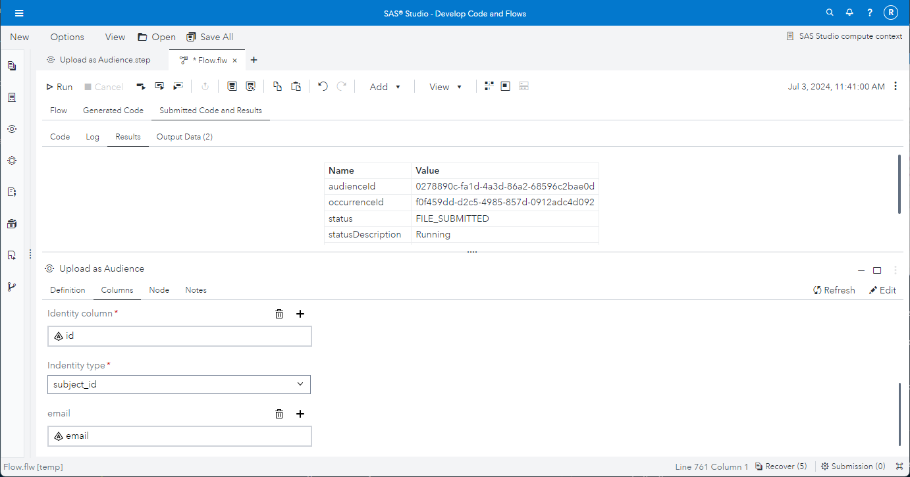

# 360 Audience From Viya Custom Step

This asset provides a way to define and load a CI 360 Audience from SAS Viya. The logic runs as a Custom Step in a Viya SAS Studio and uses the CI360 Audience API. 

The asset also provides a code version that runs both in SAS 9 and in SAS Viya. However, this document focuses on deploying the logic as a Custom Step and run in in a SAS Studio Flow. 

##	Requirements

-	Access to a SAS Studio on Viya.
-	Connection details of a CI 360 Access Point and a CI 360 API User.
-   Awareness of SAS Studio, CI 360 connectivity and CI 360 Audiences.

## Configuration 
1.	Connect to SAS Studio in Viya.
2.  Navigate to the **New** menu and select **Custom step**.
3.  Copy the content of *source/prompts_for_audience_step.json* to the **Prompt UI** tab.
4.  Copy the content of *source/define_and_load_audience_via_step.sas* to the **Program** tab.

There are two alternative ways to provide credentials to the custom step. The next bullets provides the simplest approach, which involves hardcoding the connection details in the code. If instead, you want to read the details from an external source or be able to switch between tenants from the custom step, jump to **step 8**. 

5.	On the **Program** tab, near the top of the code, fill in the macro variables values for external_gateway, tenant_id, client_secret, api_user and api_password corresponding to your CI 360 environement.
6.  On the **Design** tab delete the **Tennant connection profile** parameter.
7.  **Save** your custom step and skip ahead to the **Running** section below.

8.  If you want use multiple tenant profiles from the custom step, create your own version of the work.user_profiles dataset based on the *samples/sample_ci360_user_profile_work_dataset.sas* program. 
9.  On the **Design** tab adapt the values for the  **Tennant connection profile** parameter to correspond with the values of the **profile** column in the work.user_profile dataset.
10. **Save** your custom step.
11. Make sure the work.user_profiles dataset exists before your run the custom step.

## Running

12.  Navigate to the **New** menu and select **Flow**.
13.  Add your the custom step to the flow, by draging it from the **Explorer** Navigation Pane navigate to the flow canvas.
14.  The custom step node required an input table to be connected to it's input port. That table should contain all the audience data. Link a table or a node that generates an output table to the custom step node.
11. Fill in the paramaters and **Run** the flow. 

### Usage and Troubleshooting

-   Check the output in the **Results** screen. 
-   Connectivity and data errors will show in the **Log**. 
-   More detailed logging can be activated by setting the **audience_debug** macro variable to 1 in the Custom Step program. Refersh the flow to capture the changes in the custm step.
-   Check the Audience status in the CI 360 UI or via *source/get_audience_occurrences.sas*.
-   Running an Audience that already exists will reload the data.
-   The audience rerun may fail if the input data structure does not correspond to how the audience was defined initially. Alter or delete the **Audience Definition** as needed.
-   It is worth to **Preview** the audience data in the CI 360 UI after changing the Audience Definition and rerunning the Audience.

