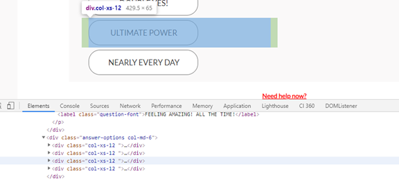

# CSS Selector Guide

## [1 Introduction](#_Toc60669843)

### &nbsp;&nbsp;&nbsp;[1.1 Purpose of this Document](#_Toc60669844)

### &nbsp;&nbsp;&nbsp;[1.2 Target Audience](#_Toc60669845)

### &nbsp;&nbsp;&nbsp;[1.3 Considerations](#_Toc60669846)

## [2 CSS Selectors](#_Toc60669847)

### &nbsp;&nbsp;&nbsp;[2.1 What are CSS selectors?](#_Toc60669848)

### &nbsp;&nbsp;&nbsp;[2.2 Important Selectors](#_Toc60669849)

#### &nbsp;&nbsp;&nbsp;&nbsp;&nbsp;&nbsp;[2.2.1 Tag Selector](#_Toc60669850)

#### &nbsp;&nbsp;&nbsp;&nbsp;&nbsp;&nbsp;[2.2.2 ID Selector](#_Toc60669851)

#### &nbsp;&nbsp;&nbsp;&nbsp;&nbsp;&nbsp;[2.2.3 Class Selector](#_Toc60669852)

#### &nbsp;&nbsp;&nbsp;&nbsp;&nbsp;&nbsp;[2.2.4 Attribute Selector](#_Toc60669853)

### &nbsp;&nbsp;&nbsp;[2.3 How to use CSS selectors](#_Toc60669854)

#### &nbsp;&nbsp;&nbsp;&nbsp;&nbsp;&nbsp;[2.3.1 Children Selectors](#_Toc60669855)

#### &nbsp;&nbsp;&nbsp;&nbsp;&nbsp;&nbsp;[2.3.2 Multiple Class Selectors](#_Toc60669856)

#### &nbsp;&nbsp;&nbsp;&nbsp;&nbsp;&nbsp;[2.3.3 Tags with Attribute selection](#_Toc60669857)

#### &nbsp;&nbsp;&nbsp;&nbsp;&nbsp;&nbsp;[2.3.4 Not Selector](#_Toc60669858)

#### &nbsp;&nbsp;&nbsp;&nbsp;&nbsp;&nbsp;[2.3.5 Input Selection](#_Toc60669859)

## [3 CSS Selectors in Use](#_Toc60669860)

### &nbsp;&nbsp;&nbsp;[3.1 How is this used in CI360 - Simple/Easy](#_Toc60669861)

### &nbsp;&nbsp;&nbsp;[3.2 How to use this in CI360 - Advanced Example](#_Toc60669862)

### &nbsp;&nbsp;&nbsp;&nbsp;&nbsp;&nbsp;[3.2.1 Event Capturing](#_Toc60669863)

### &nbsp;&nbsp;&nbsp;&nbsp;&nbsp;&nbsp;[3.2.2 Additional Information Gathering](#_Toc60669864)

### &nbsp;&nbsp;&nbsp;&nbsp;&nbsp;&nbsp;[3.2.3 Solution:](#_Toc60669865)

### &nbsp;&nbsp;&nbsp;&nbsp;&nbsp;&nbsp;[3.2.4 Testing](#_Toc60669866)

## [4 Appendix](#_Toc60669867)

### &nbsp;&nbsp;&nbsp;[4.1 List of CSS Selectors](#_Toc60669868)

### &nbsp;&nbsp;&nbsp;[4.2 External References](#_Toc60669869)

# Introduction

## Purpose of this Document

Collecting  that you would like to collect. This data can be hidden in metadata or other information stored in inputs that have been selected. On Single Page Applications, several pieces of information are not automatically captured by CI360 Discover without setting up custom events with Attributes or the JS API.

This is a guide that takes through how to use CSS selectors and how to use lesser known selectors that might prove useful for collecting data from a customer's website without the need to use the JS API which in many cases is limited by the Customer's

## Target Audience

Those that need to collect information complex information from a customer's website that isn't readily available using the built-in CI360 interface.

## Considerations

Due to the fast-changing nature of web technology be sure to stay up to date with best practices. This document's purpose is not to replace usage of the JavaScript API which is recommended for Single Page Applications (SPAs) but to supplement it.

# CSS Selectors

## What are CSS selectors?

CSS selectors are a tool to help select certain elements of a website page, specifically within the **Document Object Model (DOM)**. Within the DOM you will find a hierarchy that defines how the webpage is display and defines how the document formats data. CSS selectors allow you to select elements within the DOM for data collection.

## Important Selectors

This section contains many of the most basic selectors that can be helpful. Remember when using these selectors that if not used in explicitly or when used with contains function they will capture every element that

### Tag Selector

You can select any element tag using this selector, and it's the simplest of all the selectors.

A selector of **h2** would select a **&lt;h2&gt;&lt;/h2&gt;** element, **div** would select all **&lt;div&gt;&lt;/div&gt;** elements and so on.

This selector is very generally and is usually combined with chaining in order to specify specific areas of the DOM and usually never by itself because it can select many elements on a website, including elements we might not want.

### ID Selector

ID selectors allow you to select specific ids of an element.

**#sas** would help to select an element with an **id="sas"** attribute

**Example: &lt;div id="sas"&gt;&lt;/div&gt;**

### Class Selector

Like the ID selector, class selectors allow you to select specific div classes

**.ci360** would help to select an element with a **class="ci360"** attribute

**Example: &lt;label class="ci360"&gt;Hi Mom!&lt;/label&gt;**

### Attribute Selector

If the basic attributes like id or class aren't present or unique enough, you can always use attribute selector. The attribute selector is far more flexible than either id or class because it can be used on any attribute

**\[discover="true"\]** helps to select **discover="true">** attribute

**Example: &lt;div discover="true"&gt;&lt;/div&gt;**

## How to use CSS selectors

### Children Selectors

It's important to remember that the DOM is a hierarchy of elements. Elements can have any number of child elements and those child elements can have any number of child elements and so on. Any element in a DOM can be selected with CSS selectors.

CSS Selectors chain together have the form as below:

**#class > element > element.class > element:nth-child(2) > element**

An actual example of this:

**#root > div > div.page_\_content > div:nth-child(2) > div > div > div > div**

the 'a' div highlighted below:

With this we can see that it starts at:

- #root - using the # it selects an element with an **id** of root (id="root") in this case it is a div element, but it could be any element (&lt;p&gt;, &lt;a&gt;, etc.)
- div - selects the next **div element**, since there is no other div elements in this part of the hierarchy, there is no need to specify which one
- div.page_\_content - the '.' Means that you want to select a class with that name, so in this case we want a div element with a **class of 'page_content'**
- div:nth-child(2) - this selects the 2nd div of the page_\_content class div, each of the specific sections under a div (they don't need to be a div, they can be any different type of element underneath (&lt;p&gt;, &lt;a&gt;, etc.). For example, if there were two &lt;p&gt; elements
  - div - again selects the next div element, since there is no other div elements in this part of the hierarchy, there is no need to specify which one

This defines exactly where the selector is in the document. In many cases this is what the selector in the GUI interface for CI360 allows us to select. We can select the section that we want but the example selector is very specific and rigid. This can be an issue when the document completely changes. If a developer decides to add another div into one of the sections, we would fail to select the correct div for data collection.

### Multiple Class Selectors

Elements can have multiple classes defined. For example, the following element:

**&lt;div class="ci360 sas discover"&gt; &lt;/div&gt;**

Has three classes:

- ci360
- sas
- discover

We can use this to our advantage as elements with unique classes can be combined using a period.

The above example can be selected using any of the following:

- .ci360
- .ci360.discover
- .ci360.sas
- .ci360.discover.sas
- .ci360.sas.disocver

Not only can you use the above, but any combination of classes combined with a period between selects the example element.

### Tags with Attribute selection

Elements with specific attributes can be selected by simply using a tag combined with attribute selection.

**h2\[ci-data\]** can select h2 elements **&lt;h2 ci-data="yes"&gt;&lt;/h2&gt;** or **&lt;h2 ci-data="no&gt;** the value of the attribute in this case does not matter.

### Not Selector

This is another tool that allows us to exclude specific tags. Using **:not(p)** would exclude any **p** tagged elements. We could combine this with other selectors to great effect. **:not(p.ci360)** would exclude the following element **&lt;p class="ci360"&gt;** .

### Input Selection

This one is particularly useful to pull information from surveys or forms with inputs. By using input:checked selector you can easily select the value that a user has chosen or filled in.

Remember that many interactions with a site you might not realize are input elements. This one can be interest when combined with a click event to capture user input in a survey or form that is not already tracked automatically by CI360

# CSS Selectors in Use

## How is this used in CI360 - Simple/Easy

In many instances, these selectors are selected by CI360 when using the UI. The CI360 user interface places the customer's website in an **iFrame** and then from there we can select what we want. Whether it be on page load or a page click.

Below is the **iFrame selector interface** where we load our customer's website to select locations easily.

Then later we can select a target id, or several other attributes of the click target to trigger an event

In many cases this can be all that you need to do to capture this click event. The click event will only happen when you click on a specific element with these attributes:

- id - &lt;div id="example"&gt; this is a div element with an id of example
- name - &lt;a name="example"&gt; 'a' element with a name of example
- href - \<a href=www.example.com\\> this is generally a URL to another page or an anchor tag (#) to somewhere on the page
- selectorPath - same as earlier where we choose the path to where it goes, above example an exact path but you can also capture clicks from sections of the site instead of a specific element using "contains" functions, which will be covered later in this document
- innerText - This is the text between the opening &lt;a&gt; and closing tags &lt;/a&gt; of your elements &lt;a&gt;example&lt;a/&gt;
- onClick - This is generally JavaScript code or a function that is called in order to have an action occur on click &lt;a onClick="example()"&gt;
- HTML5 Custom Data attributes &lt;a data-example1="1" data-example2="2"&gt;.

In many of the cases above you can use "contains" instead of "equals" to have a more general solution. This allows more flexibility in how you define your event and, in many cases, allows your event to have more longevity when it comes to site changes. Developers might change the site, but your event will still capture what is needed.

## How to use this in CI360 - Advanced Example

### Event Capturing

In many cases the simplified solution above is easy to implement. It allows for the selection of elements in a visual environment that is easy to understand. But what if you want to capture clicks for an event from a section of the site as opposed to only one place. A user can click on a survey and choose whatever they want from four different choices. You wouldn't want your event to fire on only one because that complicates data management downstream.

In the example below you can see someone is choosing a value from 4 choices based on the question:

In this case we want to capture all clicks on any of the selections from "**YES**" to "**NEARLY EVERY DAY**". Using the browser developer tools we can select the area that we want capture click events and check if there are any unique values that would allow us to capture on any of the options

We first select the element using the tool on the left:

Then we can select the tool and the area we want:

Placing your mouse over specific elements in the developer's tools lets you view an overlay over the specific area

We can see from the above, that selecting the third element under answer-options allows us to select that element above. We could at this point choose to set our selector to each of these answers but you would find that it would select the specific element without a general solution, meaning we would have to setup a rule for each answer for each question (up to 40 different options)

We see that the div with a **class="answer-options"** contains the area where we want to capture clicks. In addition to this, other survey questions later use this same structure allowing us to pull that data in correctly.

We use the contains option to instruct CI360 that any selector path that contains **"answer-options"** to be eligible to trigger our event. Every child of the class **answer-options** div and all their children and so on, will be triggered by this. This is also important because any elements under our chosen element will still fire our event, even if changes are made to the underlying DOM but specifically the item that is clicked on in our example is actually an input element nested further down, setting the selectorPath to contain lets us be certain we capture clicks from an area on the page instead of specifying a specific child element.

For example, if we were to use a selector with **equals** evaluator and use a CSS selector that selected the **_Div_** at the top, we would only receive clicks on that **_Div_**. This might run into issues where the browser interprets clicking on one of the **BLUE** **a** elements or **RED** **inputs** and doesn't include the top-level **div**. We would make sure that we use **contains** evaluator.

Using **contains** for example on the **input** element (red box), we can then capture any of the tree below. All the **RED** and **BLUE** squares form the diagram above would be selected and any click on those elements would be captured.

### Additional Information Gathering

In the case of the example above, simply selecting the correct item is not enough. In many cases we want to capture additional data. For the click event an important distinction to make is that the any additional information captured in custom attributes will be captured from the page as it was when you clicked it. This means that any changes that occur to the webpage/DOM that occur will not be captured. We can use CSS selectors to select things on the page at the time of the click but there are many techniques within CSS selectors that allow us to pull specific items and values based on exclusion or different attributes.

In this example using the same survey from before. We can see that the element nested furthest down the DOM tree is an input element for all our options. When we click on an option, we want to capture which value was selected. In some cases, this is simple but in other cases we can run into issues.

There are several different considerations to make in this case:

- There are several different questions that are hidden in the DOM using JavaScript on the customer's website as a part of their Single Page Application (SPA). We want to make sure we don't select those for capturing the data
- We need to return attribute values from our elements by finding identifying values that we can capture from the list available to us in CI360

- If the attributes don't cover any of items or the development of the page has made it unlikely that we can capture what we want due to misplacement or these variables we can explore other options
- When selecting what to capture, it can be difficult due to JavaScript constantly changing the page
- Text that you want to capture could be in a difficult page, in our example the text is the inner text of the label element and not the input which makes it difficult to use **innerHTML**

### Solution

The solution requires advanced usage of CSS selectors. There are many selectors that you can use as mentioned earlier and [Linked Here](https://www.w3schools.com/cssref/css_selectors.asp). Several of these allow for selecting specific elements based on their class, multiple classes, their Id, or specific attributes including how those attributes start, ends, contains etc.

#### Hidden Questions

Using the list of CSS elements, we can see the below:

We can see that there are 10 questions and we are on the first one. The identifying CSS for this is that the class does not contain "ng-hide". Using our CSS selector guide we can see these two items specifically:

- **:not(selector) - :not(p)** - Selects every element that is not a &lt;p&gt; element

Using the not selector we are able to exclude any of the inactive questions from capturing data.

#### Input Selected

Further down the DOM tree there is an input element. These elements hold data, in many cases they look like radio buttons or check boxes. But in this case the client cannot see those in the display window. But since we know that it is an input and can be selected, we can use the following selector to select this element:

- :checked - input:checked - Selects every checked &lt;input&gt; element

Luckily by selecting this input element it also has a value attribute that contains a number which corresponds to the selected answer (0,1,2, or 3). In the CI360 interface we can setup a custom attribute for the event to capture the values we want

The following is the selector code used to make sure we capture correctly:

- **div.ng-fade.row:not(.ng-hide)>div.answer-options>div>label>input:checked**

We have successfully captured the value of the selected answer on click.

### Testing

Testing the above can be tricky in many cases. The easiest way to test if what you're collecting is correct is through setup of an agent and/or looking through the agent log. For intermediate testing of CSS selectors we can use an addon here: [CSS Selector Tester](https://chrome.google.com/webstore/detail/css-selector-tester/bbklnaodgoocmcdejoalmbjihhdkbfon). There are many tools that you can use of similar nature but I find this one to be simplest to use.

With this addon we can simply navigate to a webpage and use the CSS selector code to view if our selector code works. If it does, it will surround the section(s) we are looking for in a red-dotted line.

In this pictured example, we can use ".tile_\_title" as the selector and the three boxes are shown around the three areas above that we have selected.

# Appendix

There are many other situations where CSS selectors can be used, [here](https://www.w3schools.com/cssref/css_selectors.asp) is an updated list of most. The list linked is copied into the appendix here for easy reference.

## List of CSS Selectors

| **Selector** | **Example** | **Example description** |
| --- | --- | --- |
| [.class](https://www.w3schools.com/cssref/sel_class.asp) | .intro | Selects all elements with class="intro" |
| _.class1.class2_ | .name1.name2 | Selects all elements with both _name1_ and _name2_ set within its class attribute |
| _.class1 .class2_ | .name1 .name2 | Selects all elements with _name2_ that is a descendant of an element with _name1_ |
| [#id](https://www.w3schools.com/cssref/sel_id.asp) | #firstname | Selects the element with id="firstname" |
| [\*](https://www.w3schools.com/cssref/sel_all.asp) | \*  | Selects all elements |
| [element](https://www.w3schools.com/cssref/sel_element.asp) | p   | Selects all &lt;p&gt; elements |
| [element.class](https://www.w3schools.com/cssref/sel_element_class.asp) | p.intro | Selects all &lt;p&gt; elements with class="intro" |
| [element,element](https://www.w3schools.com/cssref/sel_element_comma.asp) | div, p | Selects all &lt;div&gt; elements and all &lt;p&gt; elements |
| [element element](https://www.w3schools.com/cssref/sel_element_element.asp) | div p | Selects all &lt;p&gt; elements inside &lt;div&gt; elements |
| [element>element](https://www.w3schools.com/cssref/sel_element_gt.asp) | div > p | Selects all &lt;p&gt; elements where the parent is a &lt;div&gt; element |
| [element+element](https://www.w3schools.com/cssref/sel_element_pluss.asp) | div + p | Selects all &lt;p&gt; elements that are placed immediately after &lt;div&gt; elements |
| [element1~element2](https://www.w3schools.com/cssref/sel_gen_sibling.asp) | p ~ ul | Selects every &lt;ul&gt; element that are preceded by a &lt;p&gt; element |
| [\[attribute\]](https://www.w3schools.com/cssref/sel_attribute.asp) | \[target\] | Selects all elements with a target attribute |
| [\[attribute=value\]](https://www.w3schools.com/cssref/sel_attribute_value.asp) | \[target=\_blank\] | Selects all elements with target="\_blank" |
| [\[attribute~=value\]](https://www.w3schools.com/cssref/sel_attribute_value_contains.asp) | \[title~=flower\] | Selects all elements with a title attribute containing the word "flower" |
| [\[attribute\|=value\]](https://www.w3schools.com/cssref/sel_attribute_value_lang.asp) | \[lang\|=en\] | Selects all elements with a lang attribute value starting with "en" |
| [\[attribute^=value\]](https://www.w3schools.com/cssref/sel_attr_begin.asp) | a\[href^="https"\] | Selects every &lt;a&gt; element whose href attribute value begins with "https" |
| [\[attribute\$=value\]](https://www.w3schools.com/cssref/sel_attr_end.asp) | a\[href\$=".pdf"\] | Selects every &lt;a&gt; element whose href attribute value ends with ".pdf" |
| [\[attribute\*=value\]](https://www.w3schools.com/cssref/sel_attr_contain.asp) | a\[href\*="w3schools"\] | Selects every &lt;a&gt; element whose href attribute value contains the substring "w3schools" |
| [:active](https://www.w3schools.com/cssref/sel_active.asp) | a:active | Selects the active link |
| [::after](https://www.w3schools.com/cssref/sel_after.asp) | p::after | Insert something after the content of each &lt;p&gt; element |
| [::before](https://www.w3schools.com/cssref/sel_before.asp) | p::before | Insert something before the content of each &lt;p&gt; element |
| [:checked](https://www.w3schools.com/cssref/sel_checked.asp) | input:checked | Selects every checked &lt;input&gt; element |
| [:default](https://www.w3schools.com/cssref/sel_default.asp) | input:default | Selects the default &lt;input&gt; element |
| [:disabled](https://www.w3schools.com/cssref/sel_disabled.asp) | input:disabled | Selects every disabled &lt;input&gt; element |
| [:empty](https://www.w3schools.com/cssref/sel_empty.asp) | p:empty | Selects every &lt;p&gt; element that has no children (including text nodes) |
| [:enabled](https://www.w3schools.com/cssref/sel_enabled.asp) | input:enabled | Selects every enabled &lt;input&gt; element |
| [:first-child](https://www.w3schools.com/cssref/sel_firstchild.asp) | p:first-child | Selects every &lt;p&gt; element that is the first child of its parent |
| [::first-letter](https://www.w3schools.com/cssref/sel_firstletter.asp) | p::first-letter | Selects the first letter of every &lt;p&gt; element |
| [::first-line](https://www.w3schools.com/cssref/sel_firstline.asp) | p::first-line | Selects the first line of every &lt;p&gt; element |
| [:first-of-type](https://www.w3schools.com/cssref/sel_first-of-type.asp) | p:first-of-type | Selects every &lt;p&gt; element that is the first &lt;p&gt; element of its parent |
| [:focus](https://www.w3schools.com/cssref/sel_focus.asp) | input:focus | Selects the input element which has focus |
| [:fullscreen](https://www.w3schools.com/cssref/sel_fullscreen.asp) | :fullscreen | Selects the element that is in full-screen mode |
| [:hover](https://www.w3schools.com/cssref/sel_hover.asp) | a:hover | Selects links on mouse over |
| [:in-range](https://www.w3schools.com/cssref/sel_in-range.asp) | input:in-range | Selects input elements with a value within a specified range |
| [:indeterminate](https://www.w3schools.com/cssref/sel_indeterminate.asp) | input:indeterminate | Selects input elements that are in an indeterminate state |
| [:invalid](https://www.w3schools.com/cssref/sel_invalid.asp) | input:invalid | Selects all input elements with an invalid value |
| [:lang(language)](https://www.w3schools.com/cssref/sel_lang.asp) | p:lang(it) | Selects every &lt;p&gt; element with a lang attribute equal to "it" (Italian) |
| [:last-child](https://www.w3schools.com/cssref/sel_last-child.asp) | p:last-child | Selects every &lt;p&gt; element that is the last child of its parent |
| [:last-of-type](https://www.w3schools.com/cssref/sel_last-of-type.asp) | p:last-of-type | Selects every &lt;p&gt; element that is the last &lt;p&gt; element of its parent |
| [:link](https://www.w3schools.com/cssref/sel_link.asp) | a:link | Selects all unvisited links |
| [:not(selector)](https://www.w3schools.com/cssref/sel_not.asp) | :not(p) | Selects every element that is not a &lt;p&gt; element |
| [:nth-child(n)](https://www.w3schools.com/cssref/sel_nth-child.asp) | p:nth-child(2) | Selects every &lt;p&gt; element that is the second child of its parent |
| [:nth-last-child(n)](https://www.w3schools.com/cssref/sel_nth-last-child.asp) | p:nth-last-child(2) | Selects every &lt;p&gt; element that is the second child of its parent, counting from the last child |
| [:nth-last-of-type(n)](https://www.w3schools.com/cssref/sel_nth-last-of-type.asp) | p:nth-last-of-type(2) | Selects every &lt;p&gt; element that is the second &lt;p&gt; element of its parent, counting from the last child |
| [:nth-of-type(n)](https://www.w3schools.com/cssref/sel_nth-of-type.asp) | p:nth-of-type(2) | Selects every &lt;p&gt; element that is the second &lt;p&gt; element of its parent |
| [:only-of-type](https://www.w3schools.com/cssref/sel_only-of-type.asp) | p:only-of-type | Selects every &lt;p&gt; element that is the only &lt;p&gt; element of its parent |
| [:only-child](https://www.w3schools.com/cssref/sel_only-child.asp) | p:only-child | Selects every &lt;p&gt; element that is the only child of its parent |
| [:optional](https://www.w3schools.com/cssref/sel_optional.asp) | input:optional | Selects input elements with no "required" attribute |
| [:out-of-range](https://www.w3schools.com/cssref/sel_out-of-range.asp) | input:out-of-range | Selects input elements with a value outside a specified range |
| [::placeholder](https://www.w3schools.com/cssref/sel_placeholder.asp) | input::placeholder | Selects input elements with the "placeholder" attribute specified |
| [:read-only](https://www.w3schools.com/cssref/sel_read-only.asp) | input:read-only | Selects input elements with the "readonly" attribute specified |
| [:read-write](https://www.w3schools.com/cssref/sel_read-write.asp) | input:read-write | Selects input elements with the "readonly" attribute NOT specified |
| [:required](https://www.w3schools.com/cssref/sel_required.asp) | input:required | Selects input elements with the "required" attribute specified |
| [:root](https://www.w3schools.com/cssref/sel_root.asp) | :root | Selects the document's root element |
| [::selection](https://www.w3schools.com/cssref/sel_selection.asp) | ::selection | Selects the portion of an element that is selected by a user |
| [:target](https://www.w3schools.com/cssref/sel_target.asp) | #news:target | Selects the current active #news element (clicked on a URL containing that anchor name) |
| [:valid](https://www.w3schools.com/cssref/sel_valid.asp) | input:valid | Selects all input elements with a valid value |
| [:visited](https://www.w3schools.com/cssref/sel_visited.asp) | a:visited | Selects all visited links |

## External References

| Item | Link |
| --- | --- |
| _CSS Selector Table (used above)_ | <https://www.w3schools.com/cssref/css_selectors.asp> |
| _CSS Selector Tester_ | <https://www.w3schools.com/cssref/trysel.asp> |
| _CSS Selector Tester Addon (for Chrome)_ | <https://chrome.google.com/webstore/detail/css-selector-tester/bbklnaodgoocmcdejoalmbjihhdkbfon> |
