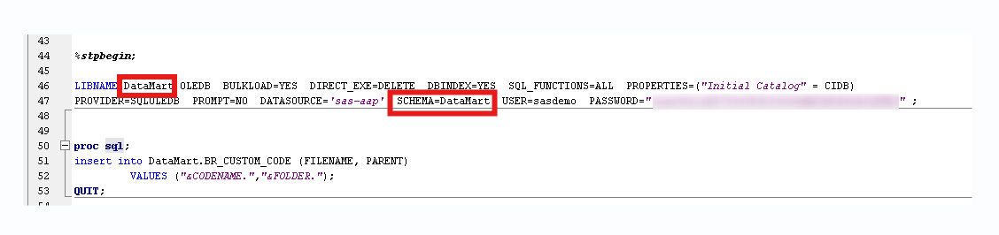
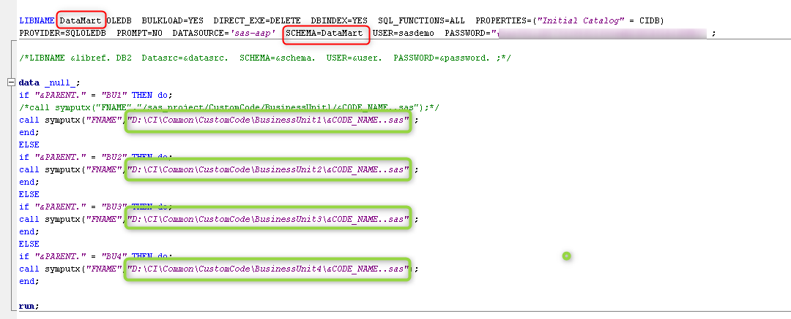
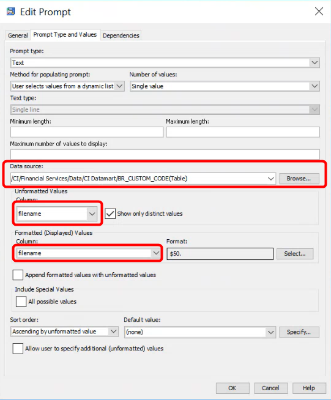
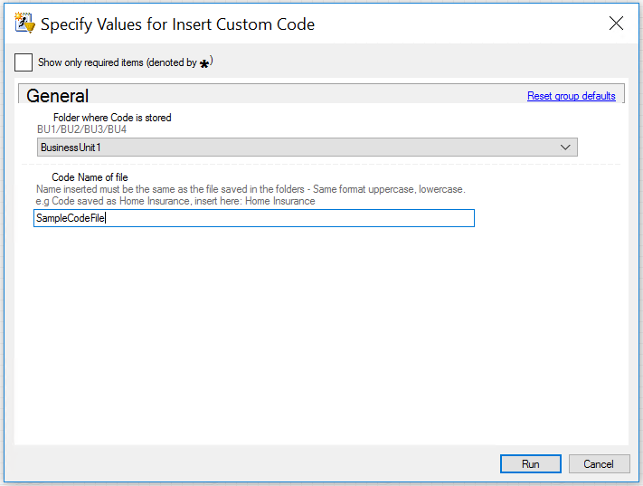
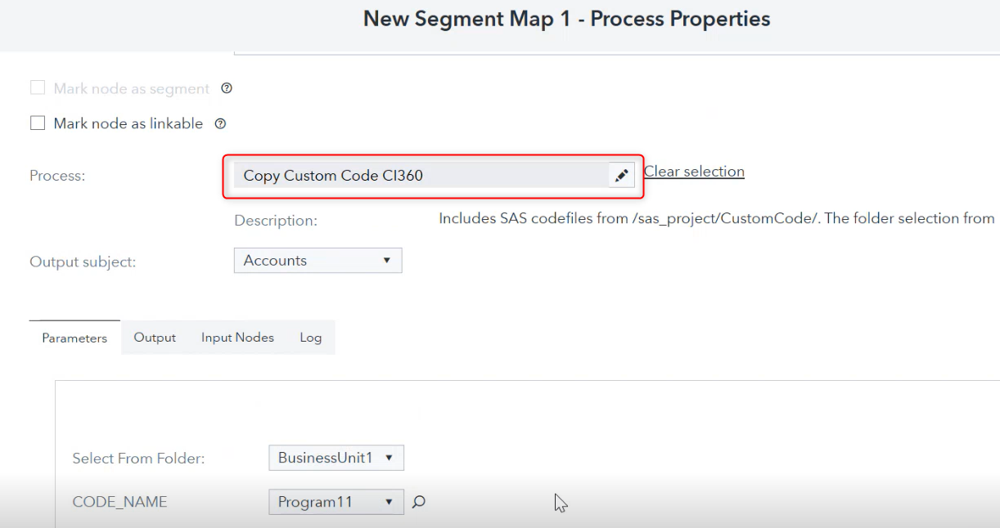

# CI360 Custom Code Nodes
## Table of contents
The Custom Code CI360 stored process extracts SAS code from a specific folder path and makes them available to run in Customer Intelligence 360 as part of a stored process.


- [Overview](#Overview)
  - [Prerequisites](#Prerequisites)
- [Configurations](#configurations)
  - [Configure stored processes in SAS Management Console](#configure-stored-processes-in-sas-management-console)
  - [Configure Folder structure](#configure-folder-structure)
  - [Configure Database Table](#configure-database-table)
  - [Update Stored Processes source code](#update-stored-processes-source-code)
- [Execution](#execution)

## Overview

Customer Intelligence 360 does not have a “code node” that allows for SAS code to be entered and run directly from a task or segment map.  SAS code can only be used from within a stored process in a process node. 
The Custom Code CI360 stored process utility is designed to extract SAS code from a specific folder path and make them available to run in Customer Intelligence 360.

The SAS package consists of two stored processes:
1. **InsertCustomCode.spk** - This stored process reads the code file and insert it into a database table.
2. **CopyCustomCode.spk** - This stored process reads the code file from database table and copy it in 360 process node to make it available in Customer Intelligence 360 for further processing.

### Prerequisites
- Base SAS, SAS Management Console
- Access to a SAS Customer Intelligence 360 tenant.
- Awareness of 360 Engage Direct.
- 360 Direct Agent configured and running on the server. 
- Awareness of SAS Stored Process application.
- Database (SQL or other DB as per client environment) for table creation.
- Code file i.e. the .sas file which would contains actual code to run as stored process. Here we will take example of **SampleCodeFile.sas**

## Configurations
### Configure stored processes in SAS Management Console

In below steps you will import stored processes in SMC.
1. Download the repository on the machine. Copy the both SAS packages `InsertCustomCode.spk` and `CopyCustomCode.spk` to a folder/directory of your choice.
2. Start **SAS Management Console**.
3. Navigate to  the folder  where you wish to save the STP.
3. Right-click the folder and choose Import SAS Package.
   * In the Import package wizard, browse to the SAS package `InsertCustomCode.spk` saved as part of step 1.
   * Choose 'All Objects' and click 'Next'.
   * Specify the SAS application server and click 'Next'
   * Specify the source code repository and click 'Next'
   * Verify the summary page and click 'Next'
   * The package will be imported with a message "The import process completed successfully".
   * Click 'Finish' to exit the wizard.
4. Repeat step 3 to 4 for SAS Package `CopyCustomCode.spk`.

### Configure Folder structure
To insert the code file's name in database table by using `InsertCustomCode.spk`, first create the folder structure and store the code file as directed below.
1. Create a folder **CustomCode** to any folder location on the server. Under this folder create 4 sub-folders called as:
   1. BusinessUnit1
   2. BusinessUnit2
   3. BusinessUnit3
   4. BusinessUnit4
5. Under folder BusinessUnit1 copy the code file **SampleCodeFile.sas**.
6. If you have code files to be run against other specific BusinessUnits and then repeat above steps of copying respective code file under other BusinessUnit folders.

### Configure Database Table

Create a database table called BR_CUSTOM_CODE table in a library that can be accessed by the custom code and end users have correct permissions for. The table should contain two columns:


**FILENAME** – holds the name of the SAS program

**PARENT** – the name of the folder where the codes are saved – e.g. BusinessUnit1, BusinessUnit2 etc.

For example, in below steps we are creating a DB table that will store the code file's name. We will take example of SQL db.
1. Created a database table called BR_CUSTOM_CODE under CIDB database using below query
```commandline
 create table CIDB.DataMart.BR_CUSTOM_CODE(fileame varchar(50), parent varchar(50))
```

### Update Stored Processes source code

Here you will update both stored process in SMC as mentioned in below steps.

a. Add/update Libname statement in source code of both stored packages and save it. Refer below for an example.
1. Libname in InsertCustomCode source file.


2. Libname in CopyCustomCode source file. Also make sure to update the folder path of code file for each business unit as highlighted in below example.


b. For CopyCustomCode stored process, update the datasource value of the 2nd parameter i.e. CODE_NAME by using below steps.
1. Right click CopyCustomCode stored process to open Properties.
2. Navigate to Parameters -> expand Prompt group -> select CODE_NAME -> click Edit -> select Prompt Type and values.
3. For Data source select the table BR_CUSTOM_CODE and make sure to have filename as selected column.


## Execution

Here are the steps you can follow to execute this utility.

1. Create and save custom SAS custom code as a SAS Program. For Example SampleCodeFile.sas file.
After testing in SAS Enterprise Guide, the SAS program should be saved to one of the BusinessUnit's folders created previously ([Configure Folder structure](#configure-folder-structure)).
2. Open InsertCustomCode stored process in Enterprise Guide click run. 
3. Choose the folder where the code is stored and enter the name of the code file. Click Run. This step will add the program to the BR_CUSTOM_CODE table by adding a row in the BR_CUSTOM_CODE database table. 

4. Open SAS Customer Intelligence 360 tenant from the browser.
5. Drag a process node onto the segment map or post process section of the DM task and select Copy Custom Code CI360.
6. Select the correct output subject.
7. Select the correct folder where the code has been saved.
8. Select the appropriate CODE_NAME corresponding to the SAS program (as saved in step 1).

9. Care must be taken when changing the code as it will impact any campaigns that reference the code via a process node.
