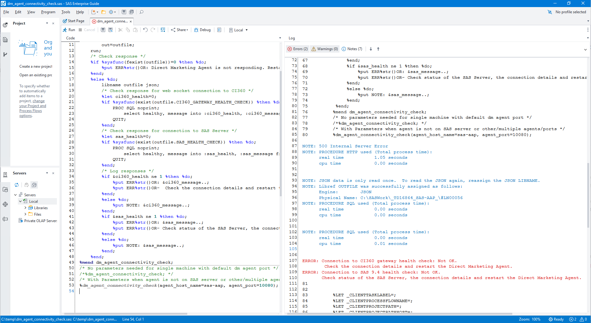

# CI360 Direct Agent Monitor

## Overview

Included utility (SAS program) assists with automating the CI360 Direct agent health check. Checking if the 360 Direct Agent process is still running on the server is not enough to assure the agent functioning properly. The agent needs to have an active web socket connecting to CI360 and a connection to the SAS server. 

### Prerequisites

- Base SAS
- Access to server where SAS Customer Intelligence 360 Direct Agent is running

## Background

A URL can be used to check the status of both these connections (active web socket to CI360 and connection to the SAS server). 

> NOTE: This URL and its response are not a part of a Public API and therefore is NOT OFFICIALLY SUPPORTED BY SAS and can be SUBJECT TO CHANGE without prior notification.

```
http://<agent_host>:<agent_port>/CIOnPremDirect/rest/commons/diagnostics
```

A JSON repsonse like this will be returned: 
```json
{
"CI360 gateway Health Check":{"healthy": true,"message":"Connection to CI360 gateway OK","error":null},
"SAS Health Check":{"healthy": true,"message": "Connection to SAS 9.4 OK","error": null},
"hash1":{"healthy": true,"message": "355f9212e7a7e95f9ef236798ba5659107ac783d","error": null}
}
 ```

A simplest way to call this API is via curl. Here is an call and response example from a Windows command line:
```bash
curl --location "http://127.0.0.1:10080/CIOnPremDirect/rest/commons/diagnostics"
{"CI360 gateway Health Check":{"healthy":false,"message":"Connection to CI360 gateway health check: Not OK","error":null},"SAS Health Check":{"healthy":false,"message":"Connection to SAS 9.4 health check: Not OK","error":null},"hash1":{"healthy":true,"message":"5545ee480a5e7b3d0e0514edc145a5b07e5cdc3e","error":null}}
```

Ideally an IT Monitoring tool would monitor the response of such a call. However, if you have a SAS team that administers the agent and prefers to schedule a sas batch job, they can do so using this utility.

## Usage

SAS program dm_agent_connectivity_check.sas, included it this repository, is executed to perfom required checks. The syntax for executing the program is: 

```
sas -sysin dm_agent_connectivity_check.sas -log dm_agent_connectivity_check.log
```

Depending on the status of the connections, dm_agent_connectivity_check.sas writes these messages in the log:
- NOTE: Connection to CI360 gateway OK.
- NOTE: Connection to SAS 9.4 OK.
- ERROR: Direct Marketing Agent is not responding. Restart agent please.
- ERROR: Connection to CI360 gateway health check: Not OK.
        Check the connection details and restart the Direct Marketing Agent.
- ERROR: Connection to SAS 9.4 health check: Not OK.
       Check status of the SAS Server, the connection details and restart the Direct Marketing Agent.


Image: Interactive dm_agent_connectivity_check.sas execution

## Future Enhancements

A potential improvements of dm_agent_connectivity_check.sas would be to send out a notification email in case of an error.
