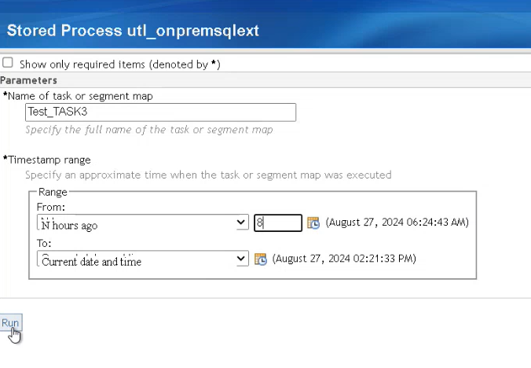
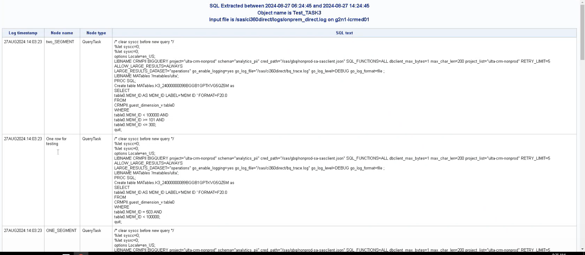

# SAS Customer Intelligence 360 SQL Extraction Utility

## Table of Contents
Welcome to the SAS Customer Intelligence 360 SQL Extraction Utility. This utility is build for extracting all SQL statements specific to a task or segment map from huge log file of Direct agent.

- [Overview](#overview)
  - [Prerequisites](#prerequisites)
- [Configuration](#configuration)
  - [Initialization](#initialization)
- [Execution](#execution)
- [Example](#example)


## Overview

This utility is a helper tool, if you want to review all the SQL statements that were generated/executed as part of a task or segment map execution. 

There could be scenarios as mentioned below where this utility could be useful:
1. When one wants to reproduce a slow running query outside of 360 Engage:Direct.
2. When one wants to check the "join criteria" used for different tables and confirm that the Information Map was configured.

The stored process shows you a screen to enter the name of a task or segment map, as well as an approximate range of timestamps to search for a specific execution occurrence of the task or segment map.
The extracted SQL is shown as a tabular report.  You can easily copy/paste the SQL to a database client tool or SAS Studio for analysis.
### Prerequisites

- Base SAS, SAS Management Console
- Access to a SAS Customer Intelligence 360 tenant.
- Awareness of 360 Engage Direct, 360 Direct Agent.
- Awareness of SAS Stored Process application.

## Configuration

1. Download the repository on the machine. Copy the SAS package `SASCI360_SQL_Extraction.spk` for Linux and `SASCI360_SQL_Extraction_Win.spk` for Windows, to a folder/directory of your choice.
2. Start **SAS Management Console** and navigate to  the folder  where you wish to save the STP.
3. Right click the folder and choose Import SAS Package.
   * In the Import package wizard, browse to the SAS package `SASCI360_SQL_Extraction.spk` for Linux and `SASCI360_SQL_Extraction_Win.spk` for Windows, saved as part of step 1.
   * Choose 'All Objects' and click 'Next'.
   * Specify the SAS application server and click 'Next'
   * Specify the source code repository and click 'Next'
   * Verify the summary page and click 'Next'
   * The package will be imported with a message "The import process completed successfully".
   * Click 'Finish' to exit the wizard.

### Initialization
1. Navigate to the source code repository specified and customize the source code `SASCI360_SQL_Extraction.sas` for Linux and `SASCI360_SQL_Extraction_Win.sas` for Windows.
   * Locate the begining `%let p_infileDir= ` in the source code file. This variable must be customized to the directory containing the onprem_direct.log files.
	For Example:
      - For Linux: ```%let p_infileDir=/sas/ci360direct/logs;```
      - For Windows:```%let p_infileDir=D:\sas\ ci360direct\logs;```
2. It is also assumed that the `onprem_direct.log` files are suffixed by a date: .yyyy-mm-dd. For Example: onprem_direct.log.2024-08-28
3. The following variables will be the parameters retrieved via the STP

   * **p_objName (mandatory)**: This is task or segment name for whom the SQLs need to be retrieved.
   * **p_startTS (mandatory)**: Start timestamp to be processed from log.
   * **p_endTS (mandatory)**: Last timestamp to be processed from log.
4. It is assumed that Start Date and End date are same.

## Execution

Here are the steps you can follow to execute the utility:

1. Access the SAS Stored Process Web Application from your browser and the url is (replace HOSTNAME with host where utility is running):
```
http://HOSTNAME/SASStoredProcess/do
```
2. Login to the SAS Stored Process Web application.
3. From the home page click `Search for Stored Process and Reports` and specify the name: `SASCI360_SQL_Extraction`.
4. The search results should show the folders where you had imported the package `SASCI360_SQL_Extraction` for Linux and `SASCI360_SQL_Extraction_Win` for Windows.
5. You can click on the name/link to start the stored process.
6. Bookmark the link to your favorites or copy it to your notepad. You can now use the link to access the stored process.


## Example
Here is an example of extracting SQL queries used within a Task `Test_Task3`.



On click of `Run` below output was received. This gives you a detail like the log timestamp, Nodes name, Nodes Type and the SQLs text used for that task.



This way using this utility you can find out all the SQLs for a specific Task or a Segment Map, along with other details like nodes name and nodes type.


