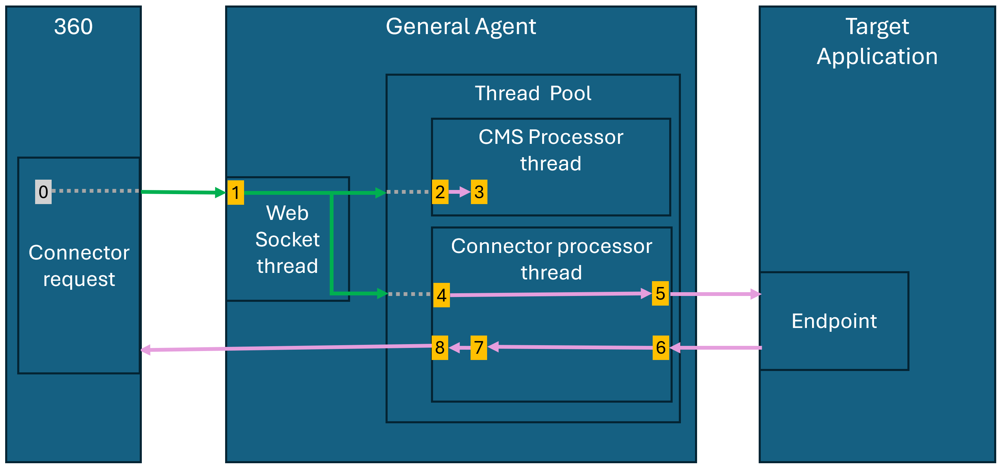
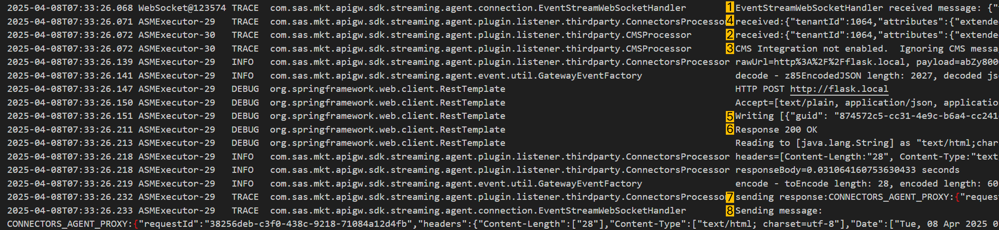
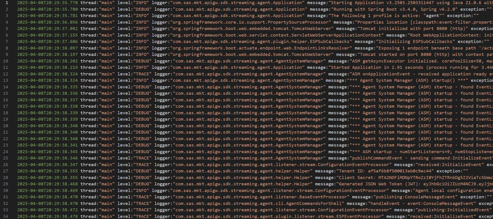
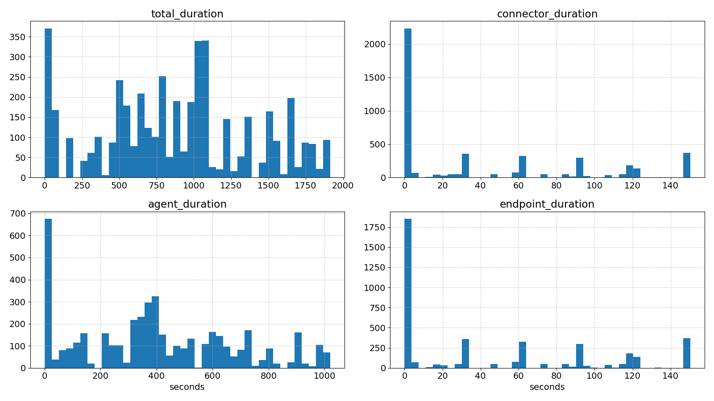
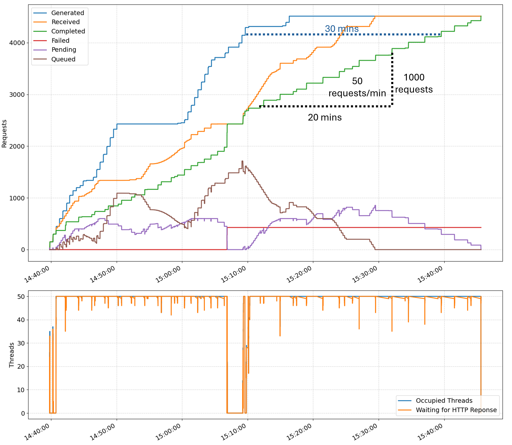
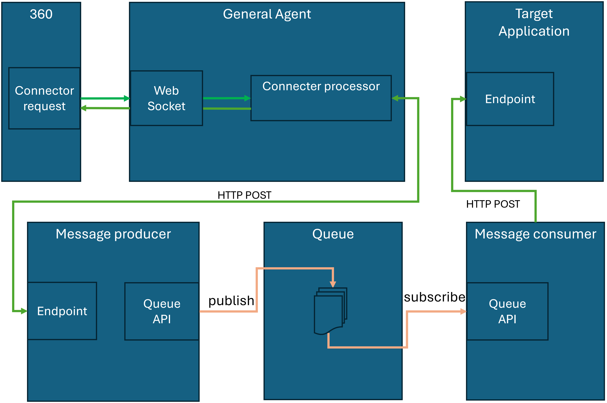
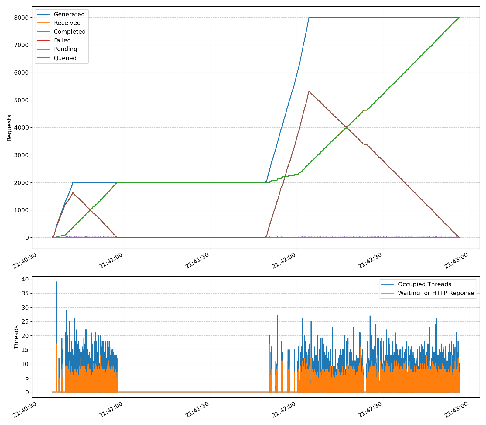

# SAS CI 360 General Agent log analyzer

## Table of Contents
- [Introduction](#introduction)
  - [Connector request life cycle](#connector-request-life-cycle)
  - [Log analyzer data](#log-analyzer-data)
- [Deployment](#deployment)
  - [Prerequisites](#prerequisites)
  - [Log configuration](#log-configuration---logback-springxml)	
- [The log analyzer](#the-log-analyzer)
  - [Python requirements](#python-requirements)
  - [Log analyzer scripts](#log-analyzer-scripts)
  - [Running the log analyzer](#running-the-log-analyzer)
- [A typical scenario](#a-typical-scenario---target-endpoint-with-limited-throughput)
  - [Setup](#the-setup)
  - [Analysis](#analysis)
- [High volumnes with a limited throughtput](#how-to-manage-high-volumnes-with-a-limited-throughtput)
  - [Option 1](#option-1-use-a-bulk-task-insetad-)
  - [Option 2](#option-2-increase-target-endpoint-throughput)
  - [Option 3](#option-3-local-queue)
  - [Example scenario with a local queue](#example-scenario-with-a-local-queue)
- [Agent performance tuning and scaling](#agent-performance-tuning-and-scaling)
- [Contributing](#contributing)
- [License](#license)
- [Additional Resources](#additional-resources)
		
## Introduction
The SAS CI 360 General Agent log analyzer provides insights on performance metrics, when integrating a CI360 custom connector with an on-premises endpoint (See [How a Custom Connector Works with an On-Premises Agent](https://go.documentation.sas.com/doc/en/cintcdc/production.a/cintag/data-integration-on-prem.htm#n1r6v9qgj9slgjn12ik0czig50xf) ).

The tool applies python scripts to
- capture general agent performance metrics by parsing agent log files. 
- vizualize these performance metrics

## Connector request life cycle

The diagram below illustrates the steps involved when the general agent processes a request from a custom connector:



In the general agent log this looks like:



## Log analyzer data
The log parser generates 2 datasets, `requests` and `records` that contain data for the requests reported in the logs.

`requests` dataset captures timestamps for each of the request processing steps (see highligted step numbers in illustrations above ⬆️):

| step | request timestamp      | description |
|------|------------------------|-------------|
| 0    | `event_dttm`           | Outbound connector event is generated in CI-360 (event_dttm captured as `date.generatedTimestamp` in the event json) |
| 1    | `request_start_dttm`   | Websocket (EventSteamWebSocketHandler) fetches event from CI-360, and submits two tasks (connector processing and CMS processing) to the agents task executor thread pool |
| 2    | `cms_start_dttm`       | CMSProcessor receives event                                                 |
| 3    | `cms_end_dttm`         | CMSProcessor ignores event                                                  |
| 4    | `connector_start_dttm` | ConnectorProcessor receives the event and starts processing                 |
| 5    | `endpoint_start_dttm`  | Agent posts event payload the target endpoint                               |
| 6    | `endpoint_end_dttm`    | Agent receives response from the target endpoint                            |
| 7    | `connector_end_dttm`   | ConnectorProcessor sends response payload to the EventSteamWebSocketHandler |
| 8    | `request_end_dttm`     | EventSteamWebSocketHandler uploads payload response to CI-360               |

The `records` dataset captures aggregated metrics at relevant timestamps:

| metric (count)       | description                                                                    | aggregation                                              |
|----------------------|--------------------------------------------------------------------------------|----------------------------------------------------------|
| `requests_generated` | Number of generated requests in 360. This is inferred locally based on timestamp in received event payload | Increments at step 0         |
| `requests_received`  | Number of requests received by general agent                                   | Increments at step 1                                     |
| `requests_completed` | Number of requests processed by general agent                                  | Increments at step 8                                     | 
| `requests_failed `   | Number of requests that failed during processing                               | Increments on exception in ConnectorsProcessor           | 
| `requests_pending`   | Number of received request, that are waiting to be processed                   | `requests_received - requests_completed`                 |
| `requests_queued `   | Number of requests generated in 360, but not yet received by general agent     | `requests_generated - requests_received`                 |
| `occupied_threads`   | Number of occupiued threads in thread pool                                     | Increments at steps 2 and 4. Decrements at steps 3 and 7 |
| `endpoint_waiting`   | Number of requests than have been posted to endpoint, and waiting for response | Increments at step 5. Decrements at step 6               |

## Deployment

### Prerequisites 

You will need
 - A 360 General Access Point (Agent) deployed and working with a custom connector.
 - Python3 including packages: matplotlib and pandas

### Log configuration - `logback-spring.xml`

A few changes are needed in the log configuration to ensure that all relevant messages are logged and that the log format is compliant with the log parser.

This reqires modification of the file `logback-spring.xml` that is located in the `config` directory of the agent framework.

Note: Make sure to take a backup of `logback-spring.xml` before proceeding.

#### Specify log format

In `logback-spring.xml`, modify the existing `<encoder>` tag from the log file to include a `<pattern>` tag **exactly** like this:

```xml
<encoder>
  <pattern>%d{yyyy-MM-dd'T'HH:mm:ss.SSS, UTC} thread:"%thread" level:"%level" logger:"%logger" message:"%replace(%msg){'[\r\n]+', '↵'}" exception:"%replace(%ex){'[\r\n]+', '↵'}"%n</pattern>
  <charset>UTF-8</charset>
</encoder>
```

Note:
- The log parser expects this **exact** pattern.
- newlines are safly encoded as the unicode character `'↵'`.

#### Configure log levels

Set log levels in `logback-spring.xml` as shown below:

```xml
<logger name="com.sas.mkt.apigw.sdk" level="TRACE"></logger>
<logger name="org.springframework.web.client.RestTemplate" level="TRACE"></logger>
```

This ensures that the log contains the relevant log lines for the log analyzer.

#### Sample log configuration

The final `logback-spring.xml` will look similar to this:
```xml
<?xml version="1.0" encoding="UTF-8"?>
<configuration>
  <appender name="SAS_FILE" class="ch.qos.logback.core.rolling.RollingFileAppender">
   <file>${APP_HOME}/logs/sas.mkt.apigw.sdk.log</file>
    <append>true</append>
     <rollingPolicy class="ch.qos.logback.core.rolling.FixedWindowRollingPolicy">
      <maxIndex>4</maxIndex>
      <FileNamePattern>${APP_HOME}/logs/sas.mkt.apigw.sdk.log.%i
      </FileNamePattern>
    </rollingPolicy>
    <triggeringPolicy
      class="ch.qos.logback.core.rolling.SizeBasedTriggeringPolicy">
      <maxFileSize>20MB</maxFileSize>
    </triggeringPolicy>
    <encoder>
      <pattern>%d{yyyy-MM-dd'T'HH:mm:ss.SSS, UTC} thread:"%thread" level:"%level" logger:"%logger" message:"%replace(%msg){'[\r\n]+', '↵'}" exception:"%replace(%ex){'[\r\n]+', '↵'}"%n</pattern>
      <charset>UTF-8</charset>
    </encoder>
  </appender>
  <logger name="com.sas.mkt.apigw.sdk" level="TRACE"></logger>
  <logger name="org.springframework.web.client.RestTemplate" level="TRACE"></logger>
  <root level="INFO">
    <appender-ref ref="SAS_FILE" />
  </root>
</configuration>
```
See [sample config file](data/logback-spring.xml) for reference.

#### Apply log configuration

Restart general agent with the new log settings.

Check that the agent log content looks similar to this:


See [sample log file](sample/sample.log) for reference.

## The log analyzer

### Python requirements 

The analyzer requires python 3 and the python packages `matplotlib` and `pandas`.

f.ex., in a virtual environment, do
```bash
$ pip3 install matplotlib pandas
```

or

```
C:\Program Files\Python312> pip install matplotlib pandas
```
if you are on Windows.

### Log analyzer scripts
You can find the the log analyzer scripts in the [scripts](scripts/) folder.
 - `analyze_logs.py` is the main script for log analysis.
 - `log_parser.py` contains code to parse logs, calculate relevant metrics, and load/save datasets as jsonl.
 - `log_plotter.py` generates graphs using matplotlib.

### Running the log analyzer

Once tool is downloaded, the [agent log has been configured](#log-configuration---logback-springxml), and [python requrements are met](#python-requirements), you are ready to do log analysis.

Locate the script `analyze_logs.py` in the `scripts` folder. This is the main script for log analysis.

In `analyze_logs.py`:
```py
request_list, record_list = parse_log('data/sample.log')
```
parses the log file. Modify the path to parse your log file. Add more logs to the argument list to include more than one agent log, e.g. `request_list, record_list = parse_log('agent1.log','agent2.log')`

```py
request_duration(request_list, out='sample/sample_duration.png')
request_timeline(record_list, out='sample/sample_timeline.png')
```
generates performance timeline and histograms, and saves these to disk.

```py
save_as_jsonl(request_list, 'sample/sample_duration.jsonl')
save_as_jsonl(record_list, 'sample/sample_records.jsonl')
```
Saves the parsed log data as json list files (`.jsonl`). This data can be reloadad by calling `load_jsonl(`*path-to-jsonl-file*`)`.

```py
plt.show()
```
Displays the plots 

Run analyze_logs.py
```  
$ cd scripts
$ python3 analyze_logs.py
```

## A typical scenario - target endpoint with limited throughput

### The setup
Over a period of ~30 minutes, we contiously trigger a custom task at a rate of 150 requests per minute.
The custom task connects to a flask endpoint with an internal processing time of a few 100 milliseconds and 4 workers. 
25 minutes in, we restart the flask application. We continue moitoring the log until all requests are completed.

### Analysis
Datasets created in this analysis: [lowtp_requests](data/lowtp_requests.jsonl), [lowtp_records](data/lowtp_records.jsonl).

Let's check the histograms:


The total_duration histogram shows durations of up to 30 minutes - somewhat evenly distributed.
The time spent in the agent is up to 15-20 minutes, where as the actual processing of each request is up to a few minutes.
This indicates that:
- most time is spent either waiting for the event to be sent to agent, or waiting in the agent to be processed by the thread pool.
- endpoint is saturated. We see response time of up to 3 minutes, even though internal processing time is a few 100 ms.

The timepline plots provide some more insighs:



The top graph shows request counts (see [records dataset](#log-analyzer-data))
  - Blue curve shows generated request. 
  - Orange curve shows requests recevied by agent. 
  - Green curve shows completed requests. Notice that initially the throughput is relatively high (> 100 req/min), but this decreases quickly to 50 requests per minute - probably due to congestion in the target app.
  - Brown line shows queued requests (requests generated in 360 but not yet sent to agent). 
  - Purple line shows ending requests (requests received by the agent, but not processing not started - ie. waiting for thread pool)
  - Red curve shows failed requests.
  
Notice when endpoint was restarted around 15:08:
  - all pending request fail
  - steep rise in failures (red curve). 

The bottom graph shows 2 thread counts: Occupied threads and threads waiting for endpoint response.
Notice the clear saturation pattern: all 50 threads are fully occupied waiting for the endpoint to respod.

The observations above are all indications of the same underlying issue: The target endpoint is a bottleneck:
Requests come in at a pace of 150 requests per minute, while the busy target endpoint can only process 50 requests per minute (slope of green curve).

Consequences:
- Request processing time keeps increasing (check horizontal distance between blue and green curves - 30 minutes at worst).
- \> 500 unprocessed requests pending in the agent (at risk of being lost in case of failures).
- Requests queue up in CI-360. Looks like CI-360 starts throtteling the event processing.
- Thread starvation in the agent.

Scaling up the agent would not help. That would only increase the load on the target app and probably make things worse..

## How to manage high volumnes with a limited throughtput?

As the [example above illustrates](#a-typical-scenario---target-endpoint-with-limited-throughput), a high volumne of triggered custom tasks is a challange when the target endpoint has a limited throughtput.

### Option 1: Use a bulk task insetad ?
First thing to consider is if a triggered custom task is appropriate for the use case.
Bulk custom tasks are typically a much better match: The bulk task downloads a full batch of requests and posts these to the target endpoint at a controlled rate without cogensting the target application.

### Option 2: Increase target endpoint throughput
It is sometimes possible increase the throughput of the target application. Scaling up the target endpoint typically requires that a client IT DevOps team is involved.

### Option 3: Local queue
If the the above options are not feasable, then we can consider adding a local queue to the setup.
Typical options are [Redis streams](https://redis.io/docs/latest/develop/data-types/streams/), [Apache Kafka](https://kafka.apache.org/) or [RabbitMQ](https://www.rabbitmq.com/).

This setup introduces 3 new components:
 1. A queue. 
    - This will be where events sit while waiting to be processed.
    - Piggybag on existing infrasstructure if possible. 
    - Most client IT shops already operate some message queing service.
 2. A message producer.
    - This will be the new connector target endpoint.
    - Small ligtheweight code base - for example a python flask app.
    - Receive events through HTTP requests, and publish these immidiatyly to the queue.
 2. A message consumer.
    - This will be the new clint for the target app.
    - Small ligtheweight code base - for example a python service app.
    - Subscribe to events from the queue, and send these events to the target app at a controlled rate.

The request flowchart becomes more complex:



The separation of work allows for the connector endpoint and target appliction to operate at independent paces. The queue provides a safe scalable temporary storage for the requests while these are waiting for available ressources.
The throughput to the connector endpoint can be thousands of requests per second. The message consumer service posts the messages to the target endpoint at a controlled rate without cogensting the target application. 

### Example scenario with a local queue
To demonstrate the effect of a local queue, we trigger a custom task 8000 times over a timespan of a few minutes through bursts of bulk events.
The connector endpoint (measssage producer) is a basic flask app that publishes to a Redis stream (the queue).

Running the log analysis shows this timeline:



Requests complete almost immeidately as they are received. We no longer have a bottleck in the on-premises setup. 
Also note that there is no thread starvation.
The only bottleneck we see, is the rate af which the agent receives request from CI-360, which is slower than the rate of generated requests. This leads to a build-up of queued requests in the 360-backend.

Datasets used in this analysis: [redis_requests](data/redis_requests.jsonl), [redis_records](data/redis_records.jsonl).

## Agent performance tuning and scaling

Should the analysis indicate that the agent itself is a bottleneck, then it may help to scale agent resources to increase throughput.
This can be done by either horizontal or vertical scaling.

Vertical scaling
- Increase number of task executor threads.
- Setting in `config/agent-runtime.properties`; `agent.runtime.taskexecutor.corePoolSize`. Default vaule: 50.
- Increases CPU utilization for the agent process.

Horzontal scaling 
- Increase number of running agents
- Simple operation if agent is deployed in kubernetes - just increse number of replicas.
- Horzontal scaling also adds redundancy and can serve as a mean to ensure high availability.

## Additional Resources

### 360 Documentation
- General Agent:  https://go.documentation.sas.com/doc/en/cintcdc/production.a/cintag/integrating-agents-general.htm
