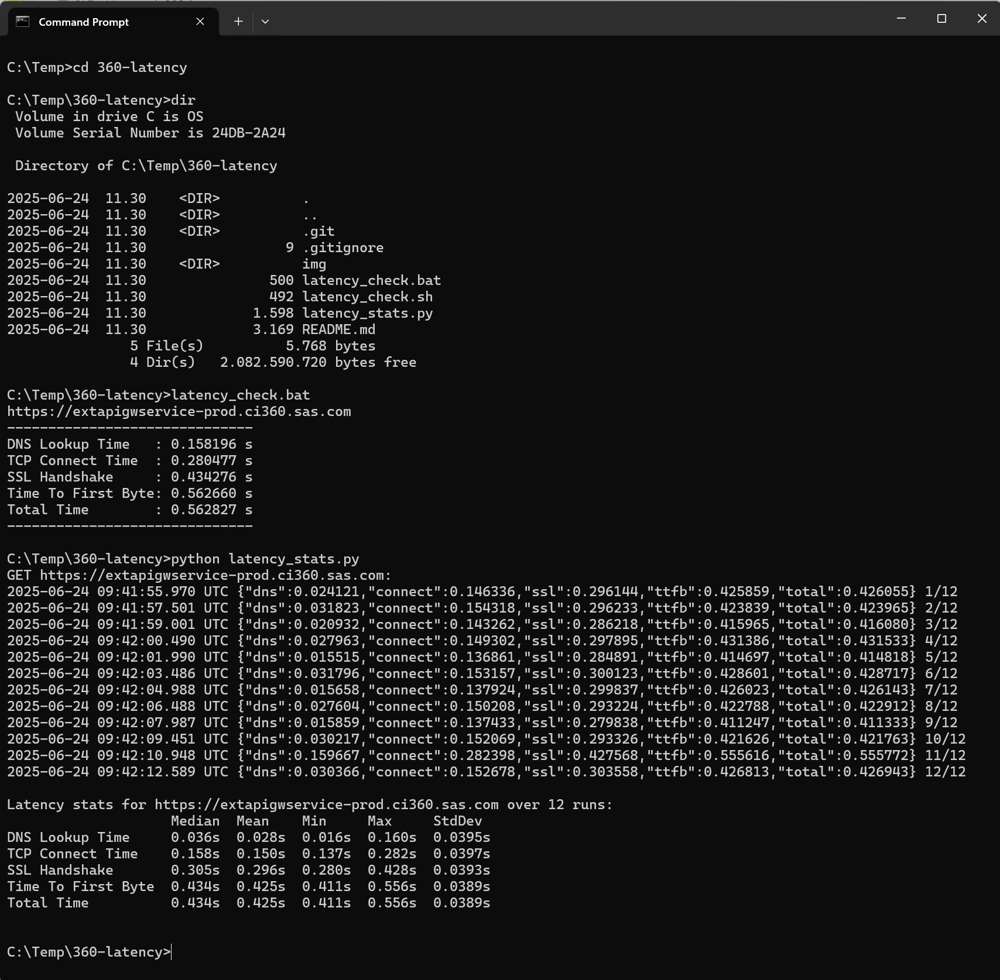
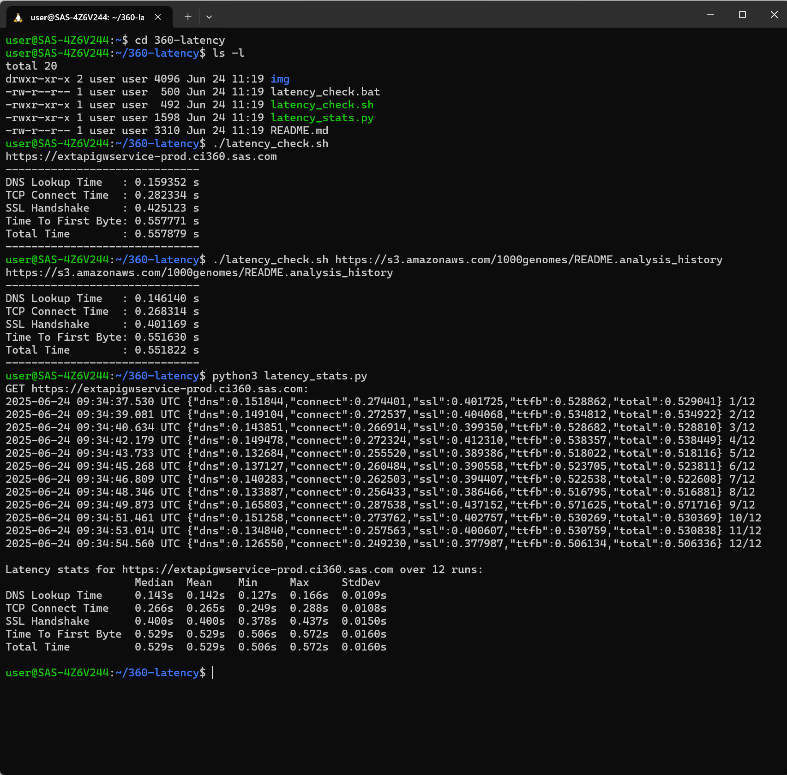

# Latency stats for 360 external gateway (and other endpoints)

## Introduction 
Network latency between client infrastructure and the 360 external API gateway can occasionally lead to performance issues.

This repository contains basic `curl` scripts for measuring key latency metrics that may help clarify such issues.

## Script Overview

| Script                                    | Script Type  | Windows | Linux | Description    |
|-------------------------------------------|--------------|---------|-------|-----------------|
| [`latency_check.bat`](./latency_check.bat)| Batch file   | ✓       | ✗    | Displays latency metrics for a single `curl` request |
| [`latency_check.sh`](./latency_check.sh)  | Shell script | ✗       | ✓    | Displays latency metrics for a single `curl` request |
| [`latency_stats.py`](./latency_stats.py)  | Python       | ✓       | ✓    | Runs multiple `curl` requests and reports plain statistics |

All scripts run a GET request towards https://extapigwservice-prod.ci360.sas.com by default.

To test a different endpoint, supply the URL as a parameter to the script. 
Examples:

```sh
./latency_check.sh https://s3.amazonaws.com/1000genomes/README.analysis_history
```

## Running scripts on Windows

1. Clone the repository or download the scripts to your machine.
2. Open a Command Prompt and navigate to the script directory:
   ```sh
   cd 360-latency
   ```
3. Run a single latency check:
   ```sh
   latency_check.bat
   ```
4. Or run multiple requests:
    ```sh
    python latency_stats.py
    ```

### Example



## Running scripts on Linux

1. Clone the repository or download the scripts to your machine.
2. Open a  Linux terminal and navigate to the script directory:
   ```sh
   cd 360-latency
   ```
3. Run a single latency check:
   ```sh
   ./latency_check.sh
   ```
4. Or run multiple requests:
    ```sh
    python3 latency_stats.py
    ```

### Example



## Latency Metrics

The scripts use `curl` write-out variables to capture these latency metrics:

| Metric                 | `curl` variable         | Description |
|------------------------|-------------------------|-------------|
| **DNS Lookup Time**    | `%{time_namelookup}`    | Time from the start until the name resolution is completed. |
| **TCP Connect Time**   | `%{time_connect}`       | Time from the start until the TCP connection to the remote host is completed. |
| **SSL Handshake**      | `%{time_appconnect}`    | Time from the start until the SSL/TLS handshake is completed (HTTPS only). |
| **Pre-transfer Time**  | `%{time_pretransfer}`   | Time from the start until just before the transfer starts (after all handshakes). |
| **Time To First Byte** | `%{time_starttransfer}` | Time from the start until the first byte is received (a.k.a. TTFB – Time To First Byte). |
| **Total Time**         | `%{time_total}`         | Total time for the complete operation, from start to finish. |

See [curl manpage](https://curl.se/docs/manpage.html#-w) for details.

Typically both **Total Time** and **Time To First Byte** should be well under one second.
