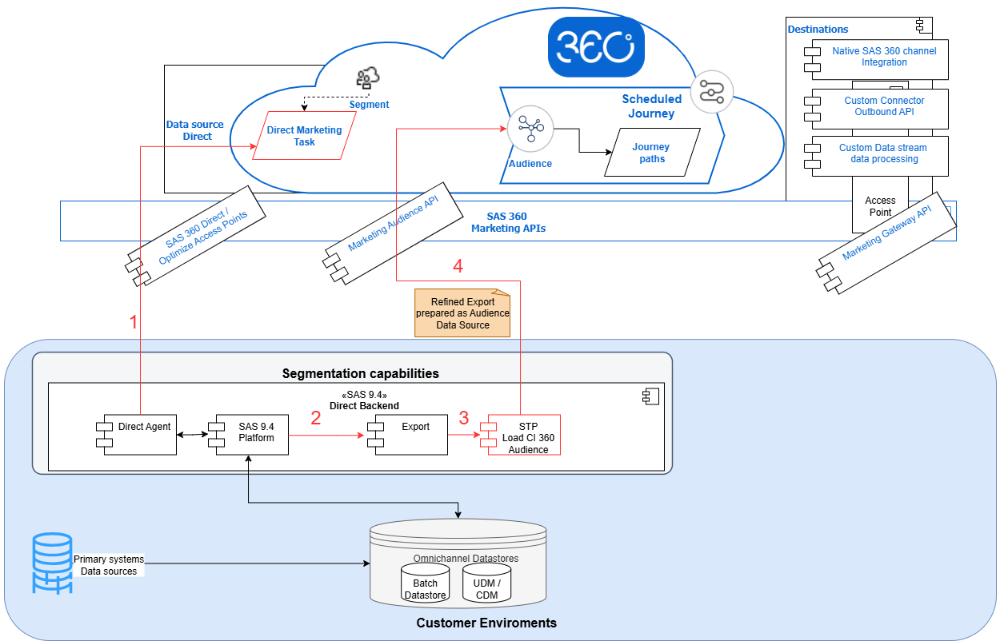
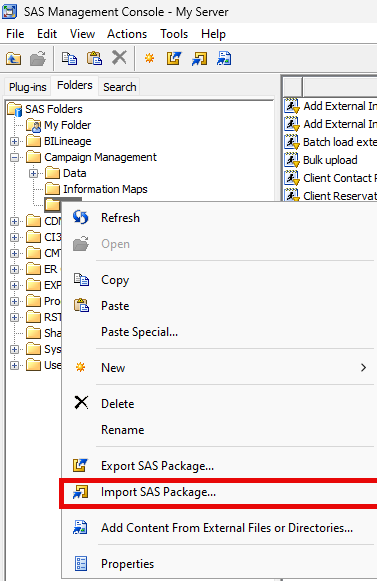
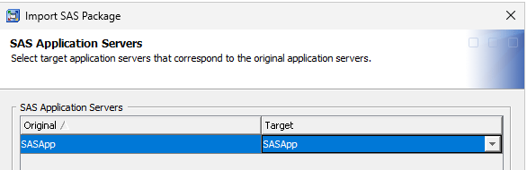
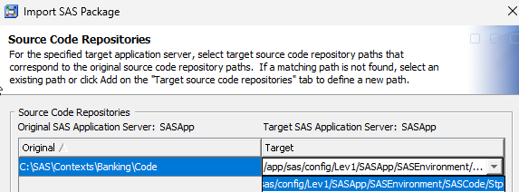
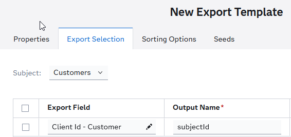
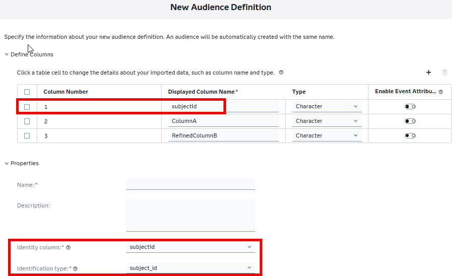
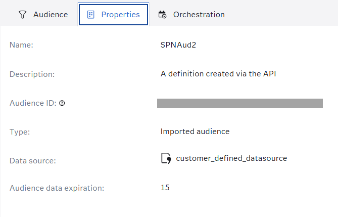
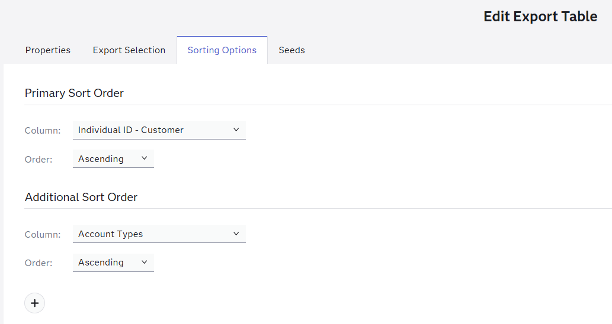
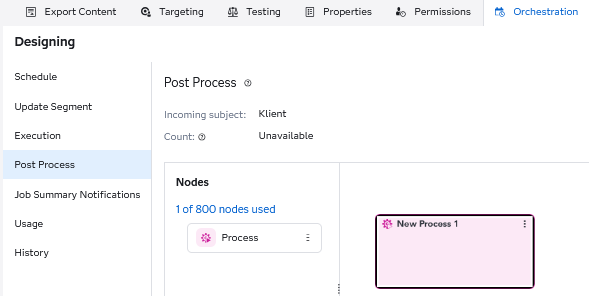
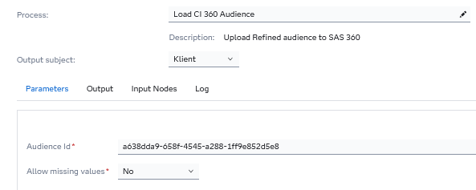

# SAS Customer Intelligence 360 – Audience Post‑Process Utility

Welcome to the SAS Customer Intelligence 360 – Audience Post‑Process Utility. This utility enables **refinement, validation, and upload** of Audience data produced by a Direct Marketing (DM) task in SAS CI 360. It addresses a key platform limitation—Direct Audience sources cannot apply *Refine* logic—which is handled by introducing a **post‑processing a stored process** at DM Task, that transforms the exported dataset and uploads a clean, validated Audience for use in **Scheduled Journeys**.

## Table of contents

- [Overview](#overview)
  - [Key Functions](#key-functions)
- [Prerequisites](#prerequisites)
- [Utility Setup](#utility-setup)
  - [SAS 360 Platform Setup](#sas-360-platform-setup)
  - [SAS 9.4 Direct Platform Setup](#sas-94-direct-platform-setup)
    - [Import the Stored Process Package (.spk)](#1-import-the-stored-process-package-spk)
    - [Setup the Autoexec parameters or Import config.dat](#2-setup-the-autoexec-parameters-or-import-configdat-file-into-your-environment)
  - [SAS 360 Export Template Definition](#sas-360-export-template-definition)
  - [SAS 360 Audience Creation](#sas-360-audience-creation)
- [Upload Audience Store Process Usage](#upload-audience-store-process-usage)
- [End Result](#end-result)
- [Logging](#logging)

## Overview

This asset acts as a **Post-process step for a Direct Marketing (DM) task**.  Once the DM task completes and generates an export (with Refine rules applied), this utility performs:
1. **Validation** against Audience definition attributes
2. **Transformation and de‑duplication**
3. **Upload** to CI 360 Audience REST API
4. **Status reporting** back to the DM task

### Key Functions
- **Ingest DM Export**
   - Accepts the DM export file (Refine already applied).

- **Validate, Transform, and De-duplicate**
   - Enforces Audience API requirements.
   - Ensures mandatory attributes exist.
   - Removes duplicate records and ensures data consistency.

- **Attribute Comparison**
   - Compares DM export fields with Audience definition attributes.
   - Validates all **mandatory columns** (For example: identity-selected attributes).

- **Audience Upload and Processing**
   - Uploads the validated file to CI 360.
   - Initiates audience processing.

- **Provide Status and Metrics**
   - Returns **status updates**, **processing metrics**, and **error batch details** back to the Direct Marketing task.

**Outcome**
- A **CI 360 Audience** with refined conditions is created.
- This audience is ready for **Scheduled Journeys**, allowing precise selection, targeting and orchestration.

**Usage:**

An user defines an Audience Source with the necessary columns, followed by the creation of a Direct Marketing (DM) Task. 
The DM Task is executed (Step 1), resulting in an export on the SAS 9 platform (Step 2). Subsequently, this export undergoes processing via a stored procedure (Post-Process Step 3) , which performs file validation and facilitates the upload of the exported and refined data into the designated SAS 360 Audience (Step 4).

---

## Prerequisites
- Access to a SAS Customer Intelligence 360 tenant.
- Access to SAS Management Console
- Connection details of a 360 Access Point and a 360 API User.
- Awareness of 360 Audiences and Direct Marketing Task.
- SAS 360 Audience Premium Licence or SAS 360 Direct + SAS 360 Audience license 

## Utility Setup
### SAS 360 Platform Setup
#### **1. Create a CI 360 Access Point**
Path: `General Settings → Access Points`
- New Access Point → *General Access Point*
- Name: Audience Upload
- Status: **Active**
- Save **Tenant ID** & **Client Secret**

#### **2. Create API User**
Path: `General Settings → API Credentials`
- API User ID: `audienceUpload-API`
- Description: `User for direct upload of refined data to Audience`
- Status: **Active**
- Generate & store the **API Secret** securely

### SAS 9.4 Direct Platform Setup
#### **1. Import the Stored Process Package (.spk)**
- Import `Load_Audience.spk` via SAS Management Console

    - Copy Load_Audience.spk file if needed to a location accessible to your SAS Management Console client.
    - Import SAS Package to your desired STP folder on SAS 9.4 Server for SAS 360
 
     
- Select SASApp as Target application server
 
     
- Select the SAS application code repository for the SAS Direct installation code, and complete the installation wizard as required.
 
        

    
#### **2. Setup the Autoexec parameters or Import config.dat file into your environment**
##### **2.1. Configure Autoexec Parameters**
Add parameters into - appserver_autoexec_usermods.sas located eg. in SAS\Config\Lev1\SASApp\appserver_autoexec_usermods.sas
    
###### Autoexec setup parameters (Example)

          %let STP_AUD_LOG_DIR          = C:\SAS\Contexts\Banking\Exports\ or /logs/sas/ci360/UploadAudience/; 
          %let STP_AUD_EMAIL_FROM       = AudienceProcess@yourcompany.com;
          %let STP_AUD_GATEWAY          = https://extapigwservice-eu-prod.ci360.sas.com;
          %let STP_AUD_TENANT_ID        = tenant_uid;
          %let STP_AUD_CLIENT_SECRET    = access_point_secret_key;
          %let STP_AUD_API_USER         = api_user;
          %let STP_AUD_API_PW           = api_password;
          %let STP_AUD_VAL_MINUTES      = 10; --how long script check the audience upload status
          %let STP_AUD_EMAIL_LIST       = "admin@yourcompany.com" "marketing@yourcompany.com";
          %let STP_proxyhost            = proxy.yoursite.com;   --do not create in autoexec if not used
          %let STP_proxypw              = proxy_password;       --do not create in autoexec if not used 
          %let STP_proxyuser            = proxy_username;       --do not create in autoexec if not used
          %let STP_proxyport            = 1234;                 --do not create in autoexec if not used    

######    Autoexec variable description:
    - STP_AUD_LOG_DIR       - Folder Path where STP will store logs
    - STP_AUD_EMAIL_FROM    - Email address which will be used as a sender for status email delivery
    - STP_AUD_GATEWAY       - SAS 360 API GW (Value from `General Settings → Access Points External gateway host`)
    - STP_AUD_TENANT_ID     - Tenant Id (Value from Audience Upload Access point)
    - STP_AUD_CLIENT_SECRET - Client Secret (Value from Audience Upload Access point)
    - STP_AUD_API_USER      - API User ID (Value from Audience Upload API User)
    - STP_AUD_API_PW        - API User Secret (Value from Audience Upload API User)
    - STP_AUD_VAL_MINUTES   - How long the Direct marketing task will try to get status of Audience upload (in Minutes) - 10 for Small Audiences -30 minutes for big Audiences (Millions  of records)
    - STP_AUD_EMAIL_LIST    - List of the email addresses  which will be notified about fail - long time upload processes
    - STP_proxyhost         - (optional) Proxy Host     - do not create in autoexec if not used
    - STP_proxyport         - (optional) Proxy Port     - do not create in autoexec if not used
    - STP_proxyuser         - (optional) Proxy Username - do not create in autoexec if not used
    - STP_proxypw           - (optional) Proxy User password - do not create in autoexec if not used
 

##### **2.2. Configuration Files - Using config.dat**
If using config.dat instead of autoexec:
- Maintain **same parameter order** as provided in project sample
- Set `projectpath` hidden parameter in STP metadata to enable log redirection

An example of the file is provide in the project.
- External_gateway - SAS 360 API GW (Value from General Settings → Access Points External gateway host)
- tenant_id - Tenant Id (Value from Audience Upload Access point)
- client_secret - Client Secret (Value from Audience Upload Access point)
- api_user - API User ID (Value from Audience Upload API User)
- api_password - API User Secret (Value from Audience Upload API User)
- minutesValidatingStatus - How long the Direct marketing task will try to get status of Audience upload (in Minutes) - 10 for 
- email_list - List of the email addresses which will be notified about fail - long time upload processes
- email_from - Email address which will be used as a sender for status email delivery   

If you use config.data file, projectpath macrovariable is used to redirect log for testing. This Macrovariable is defined as a hidden parameter in Stored Process in SAS Management Console.
 You need to set a value for your environment.

#### **3. Upload store process metadata to SAS 360**
- Upload STP to SAS 360 using Direct Marketing agent commands - Detail info about commands: https://go.documentation.sas.com/doc/en/cintcdc/production.a/cintag/dmaccess-commands.htm

      ./dm.sh sstp --bcName "<Business context in which STP will be used>" --stpFolder "<Folder where SPT was imported>" --stpName "Load CI 360 Audience"

  Example:

      ./dm.sh sstp --bcName "Main Business Context" --stpFolder "Campaign Management/STP" --stpName "Load CI 360 Audience"
    - The result of command should be: Stored Processes sent successfully

### **SAS 360 Export template definition**
- **Navigate to:**  `General Settings → Export Templates` and Create a New  Export template:
  - Template Name: Audience export template
  - File Type: SAS data set   
  - Export Name: %%TASKCODE%%%%EXPDATE%%%%EXPTIME%%
  - Export location and business context is setup based on your environment setup
  - Allow the export settings to be edited in the task or export node: YES
  - Include holdout control group members: NO
  - Discard rows with duplicate subject IDs for each input source: NO
  - Export selection:
    -  Select ID if main communication Subject (used as Subject Id)
        - Output name: subjectId

        

  - Sort Option  
    - Add sort option over the primary subject id attribute from export
      
        

### **SAS 360 Audience creation**
- Create an Audience using the API utility or in `General Settings → Audience Definition`
- Define column attributes
  - Only mandatory audience column is subjectId or any other different type of identity identifier

Example of Audience Definition: 
| Column Number | Display Column Name | Type | Enable Event Attribute Tracking
| ------ | ------ | ------ |----- | 
|    1    | subjectId        |Character| N |
|    2    | ColumnA       | ||
|    3    | RefinedColumnB       | ||

 - Identity column: subjectId
 - Identification type: subject_id

 Alternatively there is possible to use different identity type for Audience definition but such identified has to be available in refined DM export (such approach is not recommended without proper testing)

Copy Audience Id of saved audience:

## Upload Audience Store process Usage

- Create a DM Task and use Audience export template as an output.

- Add Columns to export definition. Output names in exported dataset must match attributes names in Audience definition. The process will validate it and abort the execution in case of any mismatch
- Apply Output refinement as in standard Direct Marketing Task

- Only one row per customer will be uploaded. Ensure you sort the export table by customer and select the "Discard rows with duplicate subject IDs for each input source" option. 
  If the table is sorted but this option is not used, the process will select only the first row per customer based on the sorted criteria.  

- Once you have create your DM Task, you have to add a post process node. 

- Open the process and Select Load CI 360 Audience
  -  AudienceId > audience that will be used for uploading the content of the export table; 
  - Allow missing values (YES/NO) > Used to indicate if missing values are allowed in Audiences attributes

**Do NOT mark Generate Contact Event in Direct Marketing task which is used as Upload Audience!**

## End Result

After DM Task execution:
- Navigate to CI 360.
- Validate that the Audience has been correctly populated.
- Confirm attribute mapping and row counts.

## Logging

- Logs are written to `STP_AUD_LOG_DIR`.
- If log redirection (projectpath) is used, logs route to the specified path.
- If not, logs default to `onprem.log`.

