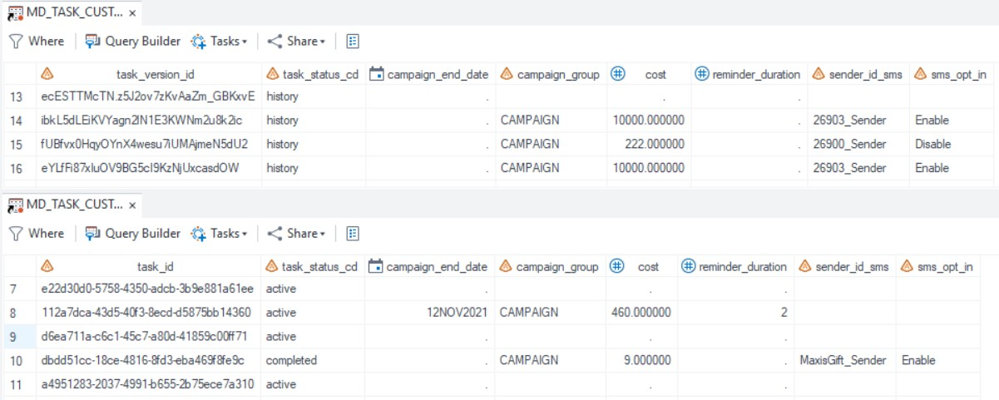

# Create _EXT views in UDM

This tool creates views in the CI 360 Unified Data Model (UDM) that transpose custom properties, so each custom property can be represented as a separate column.

## Table of Contents
- [Why and how to use the _EXT views](#why-and-how-to-use-the-_ext-views)
  - [Benefits](#the-benefits-of-these-views)
  - [Disadvantages](#the-disadvantage-of-these-views)
- [Using this utility](#using-this-utility)
  - [Requirements](#requirement)
  - [Approach](#approach)
  - [Alternative approach](#alternative-approach)
- [Integrating the views](#integrating-the-views)
  - [Note on MD_*_ALL Tables](#note-on-md_all-tables)

## Why and how to use the _EXT views
The _EXT views make it easier to filter CI 360 objects by exposing each custom property as its own column, rather than requiring combined filters on property name and value.

### Example

*Select all people who have been contacted for a Task where the "Program" custom property is set to "Brand awareness".*

### With _EXT views
This example would make use of the **MD_TASK_CUSTOM_PROP_EXT** view. In this view **"Program"** becomes a column and the user can select it in reporting or segmentation. Next the user selects "Brand awareness" from a list of values.

### Without _EXT views
Without the _EXT view the selection would need to combine **property_nm**="Program" and **property_val**="Brand awareness" from the MD_TASK_CUSTOM_PROP table. For property_val, the list of possible values combines all possible values of all properties which can result in a very long list and the user needs to know which values fit with which property.

### The benefits of these views
- Less filters to apply
- Shorter lists of values
- Combining property names and values in the wrong way becomes impossible. 

### The disadvantage of these views
- The view DDL needs to be maintained when property names evolve.

## Using this utility

### Requirement
- A database schema with the UDM tables deployed
- Database connection details with the necessary permissions to create views
- Custom property names need to be known before this utility can be deployed

### Approach
The simplest approach is to adapt the sample script to your needs and run it to generate the views. 
- To create the views using a database client, start from **sample_custom_properties_ext_views.sql**.
- To create the views using a SAS client, start from **sample_custom_properties_ext_views.sas**.

>**Note:** Users may not need to filter on all custom properties, therefore only create the views and columns that are required.

### Alternative approach
If property data already exists in the UDM MD_*_CUSTOM_PROP tables, the view DDL can be generated using **Generate_EXT_views.sas**. This script generates a custom_properties_ext_views.sql and custom_properties_ext_views.sas script for all the properties in your data. Remove unwanted views and columns and run the sql or sas script to generate the views.

>**Note:** Users may not need to filter on all custom properties, therefore remove the views or columns that are not required from the generated DDL script.

## Integrating the views 

Each view as an object ID column that uniquely identifies every row. For MD_TASK_CUSTOM_PROP_EXT the column is task_id, for MD_SEGMENT_CUSTOM_PROP_EXT it is segment_id, etc. 

Join the object ID column directly, or indirectly via a related table, with the events you want to filter. For example the CONTACT_HISTORY events table has a task_id column that can join with the task_id column of MD_TASK_CUSTOM_PROP_EXT. 
Use an inner join to eliminate non-matching events.

### Note on MD_*_ALL tables

UDM metadata tables contain only the last version of each object, while MD_*_ALL tables contain all versions. Most reporting and selections use the latest version. 

However, if you need custom property values from previous object versions,  use the MD_*_ALL_EXT view and join on the version id column. 

