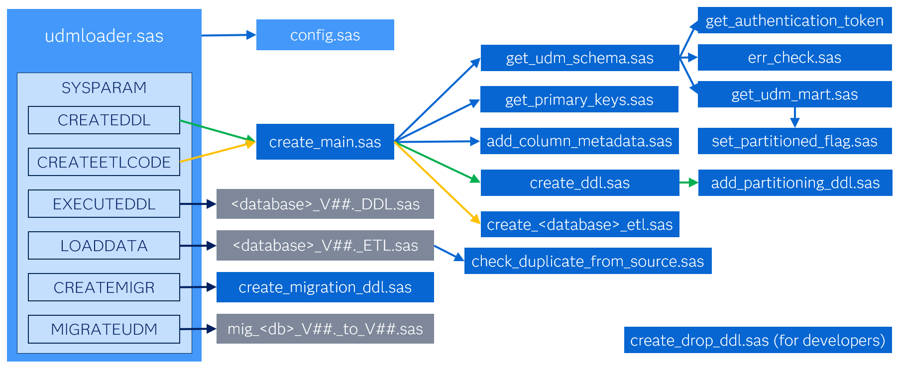

# CI360 UDM Database Loader

## Overview

The ci360-udm-db-loader utility loads data from the CI 360 Unified Data Model (UDM) into a relational database management system (RDBMS), The tool can also load the CI360 Common Data Model (CDM) which is a part of the UDM.

The utility includes database-specific Data Definition Language (DDL) to create the table structure during the initial setup.

## Supported target databases 

- Microsoft SQL Server
- SQL Server on Azure 
- Redshift
- Oracle
- Postgres

## Supported UDM Schema Version

This utility is optimized for UDM schema version 20. With version 20, a new set of metadata tables with full history is available, which eliminates the need to incrementally load metadata tables.

> **WARNING:** If you upgrade from a previous version of this utility and you use other than the latest published metadata of objects, please adjust your data source to point to the md_*_all tables of those objects instead of the corresponding md_* tables. 

## Pre-requisites
To set up the ci360-udm-db-loader, you need access to a supported database. Also note the ci360-udm-db-loader does not download the UDM data. It is built and tested to use data downloaded via the ci360-download-client-sas utility. 

So before you deploy this tool make sure you have
1.	https://github.com/sassoftware/ci360-download-client-sas deployed 
2.	access details for a the supported target database that allow to create tables and load data. Foresee a separate schema for the UDM tables and optionally a second schema for temporary tables that get created and dropped during the load process.

> **WARNING:** Downloaded SAS datasets are deleted after each succesful upload to prevents unnecessary reloading. The download tool will recreate tables as required.

> **TIP:** This tool should NOT run at the same time as the download tool. Schedule it to run after downloading. 

> **TIP:** A dataset that remains undeleted after upload indicates an upload error. Check the log.

## Setup

Unzip and copy the tool to a location on you SAS server, where you also have the ci360-download-client-sas deployed. 

## Configuration

Edit these sections in the config.sas file, located in the config folder. 

### Operating system
%let slash=/; * Set to / for Linux or \ for Windows;

### Tenant Configuration
Define tenant details and schema version for which you want to use this utility.
- %let DSC_TENANT_ID=%str(< Tenant ID Value>);
- %let DSC_SECRET_KEY=%str(< Secret Key Value >);
- %let external_gateway=https://< external gateway host >/marketingGateway;

### Schema version
- %let schema_version=20;
- %let previous_schema_version=19; 

Previous schema version is used only to create a migration script

> **WARNING:** The schema version of the downloaded data and this utility need to be align.

### Time zone
The UDM makes datetime values available in UTC. Use this configuration to adapt the time zone.

- %let timeZone_Value=AMERICA/NEW_YORK; /* Provide time zone specific value for convertion of datetime fields into target tables */

For more information on time zone and its values please see : [Time Zone Info and Time Zone Names](https://go.documentation.sas.com/doc/en/pgmsascdc/9.4_3.5/lesysoptsref/n13ytdu4ohkwoln1gtu6byka5lpd.htm)

### Bulkload
Most databases support bulkload which accelerates the load process for large data volumes.
- %let DB_BL_THRESHOLD=100000; * Apply bulkload when row count exceeds the threshold value - 0 means no bulkload, like for SQL Server ;
- %let DB_LD_OPTS =%str(INSERTBUFF=32767 DBCOMMIT=0); * alternative for bulkload;

### Path Configurations
These downloaded datasets will act as an input and will be stored under { UtilityLocation}/data folder or any location which can be set in config.sas file.

- %let utilityLocation=; /* path of the main folder of this tool, so the parent of the config folder */
- %let downloadutilitylocation=; /* path of the main folder of ci360-download-client-sas, so the parent of the data folder */

### Database Parameters
Define the third-party database name and connection details.

  > **NOTE:** The required details differ per database engine, for example Oracle used dbpath, while SQL server uses dbDataSourceName.

These macro variable shouldn't need any adaptations
- %let sql_passthru_connection = ...
- %let trg_lib_attrib = ...
- %let tmpdbschema = ...
- %let tmp_lib_attrib = ...

If you prefer to use different database schema for temporary tables you can adapt the temporary schema details. For performance the temporary schema needs to be in the same database instance as the target schema. By default the target schema also is used for temporary the tables. Temporary tables are deleted automatically.

> **NOTE:** Bulkload options also differ per database. Additional configuration options can be found in the SAS/ACCESS online help for your database.

### Data libraries
This section doesn't require any changes as it uses parameters defined above.

### Common Configurations
This section doesn't require any changes.

## ci360-udm-db-loader File Overview

The ci360-udm-db-loader should be scheduled to run after the ci360-download-client-sas utility has downloaded new data. You can create one command-line or shell script that runs both utilities in sequence. 

The **udmloader_launch** folder of this project contains the launcher code of the tool.

The **udmloader_launch** folder of this project contains the launcher code of the tool.

- **udmloader.sas**
  
  This the main macro which will launch the utility. See the usage section below for details.

The **config** folder contains below content:
- **config.sas**

  This file contains the environment specific configurations.

- **METADATA_TABLE.csv**

  This csv is UDM schema specific as it identifies which columns are a part of the primary key or each table. This CSV will be updated with every release of a new UDM schema version.

- **datatypes.sas7bdat**
  
  This data set contains datatype mapping for supported databases. This will map the schema datatypes to the database specific datatypes. This table will be updated as new database platforms are supported.

- **table_list.sas7bdat**
  
  This data set contains one row per UDM table. The execution_flag column is used to include or exclude tables when building the ddl and etl codes. The mart_type column has no impact on the processing.

The **macros** folder
- This folder contains all the logic in sas macros, in .sas code files.

The **code** folder
- This folder contains the generated DDL, load ETL code and migration DDL.

The **scripts** folder 
- This folder contains sample scripts to start this tool in batch mode or to start a sequence of download and load jobs.

## Running the ci360-udm-db-loader

Before you can load the data, the target tables need to be created. 
- Go to the **Interactive Execution** topic below to create the target data.
- Next go to **Batch Execution** to load the tool in batch 
- If you want generate DDL or load code for a new schema version of the UDM tables,  use the parameters **CREATEDDL** and **CREATEETLCODE** as described in **Interactive Execution** below.
- If you want to upgrade your UDM data structure,  use the parameters **CREATEMIGR** and **MIGRATEUDM** codes.

### Interactive Execution

To run the utility interactively (e.g. via SAS Studio or SAS Enterprise Guide), edit **udmloader.sas** from udmloader_launch folder, update **%Let sysparameter=XXXXX ;** variable with one of the below parameters and run it.

- **CREATEDDL/CREATEETLCODE** : This will  generates DDL or load code.

- **EXECUTEDDL**:This will execute the generated database specific DDL. This will pick the generated DDL code from previous step and create the tables in target Database .

   > **NOTE:** Run EXECUTEDDL only once before loading data for the first time. If a correction is needed, drop all tables before re-executing

- **LOADDATA** : This will execute the generated database specific ETL code file. It will Insert/update downloaded data into database specific target tables (you can schedule this periodically depending on the frequency of data download by using batch process). 

- **CREATEMIGR** : This will generate schema migration ddl code which will create alter and create table ddl when there is new schema version available. Set the schema_version and previous_schema version macro variables in the config.sas file accordingly.

- **MIGRATEUDM** : This will execute the generated database specific DDL schema migration script. This will pick the generated DDL migration code from previous step and create the tables in target Database. This will help create table structure based on new schema version without deleteting old tables and data.

### Batch Execution

To run this utility in batch mode you need to 
- Commment out the **%Let sysparameter=XXXXX ;** from the launcher code.
- Adapt the sample scripts in the **scripts** folder to your environment or create a new script that executes below command:

**{SASHOME}/sas –sysin {UDMLoader_Location}/UDMLoader.sas -sysparm LOADDATA -log {UDMLoader_Location}/UDMLoader.log**

- Create separate scripts if you want to download and load different set of tales at different frequencies.
- Schedule the scripts.

## Troubleshooting

The logs folder contain a log file for each execution of this utility. The MPRINT option is set to identify in the log which macro is running. 

To facilitate troubleshooting, the diagram below shows how each macro is called, depending on the sysparam or sysparameter value.  

